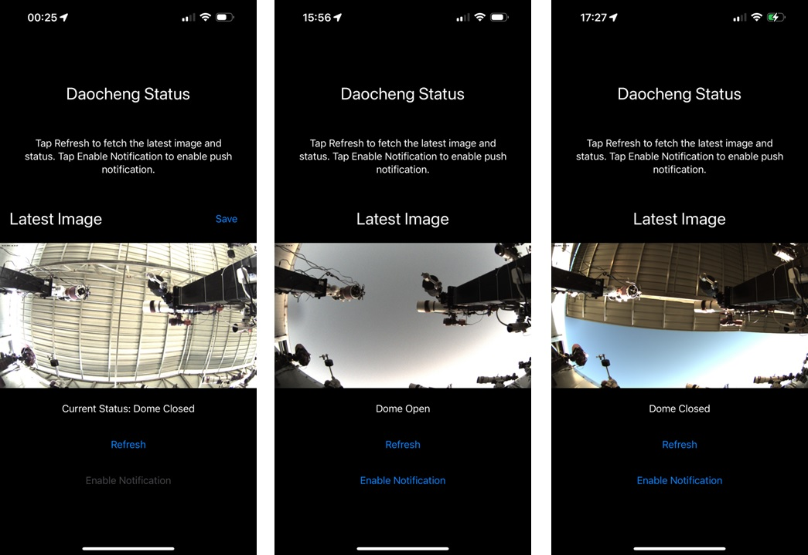

Title: The Guide to Enslave AI for Coding: How to Be the First to Fall in the Robot Revolution
Date: 2024-01-24 23:00
Category: Computing
Tags: English, AI Coding
Slug: ai-coding-en

Recently, I rented a slot at a commercial remote astronomical observatory in Daocheng, Sichuan, for [astrophotography](/star-photography-en.html). A commercial remote observatory refers to a business renting land in an area free from light pollution, providing stable electricity and maintenance services. Astronomy enthusiasts can send their equipment there to be hosted by the company. Users can remotely control their equipment for photography. The basic structure of the observatory is a large house with a rolling roof, closed during the day (closed top), and opened at night (open top) for photography. Similar to many other remote observatories in China, the main communication method for this observatory is through a WeChat group. After lurking in the group for a while, I realized that many discussions revolved around whether the observatory had opened its top or whether clouds had appeared. These issues took up a lot of the observatory director's time. Moreover, another important duty of the director was to @everyone in the WeChat group when the roof was opened, but this message, being a regular alert, often got buried in the group chat, causing many to miss their shooting opportunities.

As an engineer, I am very interested in automating such tasks. Why don't we implement an [AI system](/ai-it-impact-en.html) to analyze the surveillance footage, automatically answering these questions, and even proactively notify users when the observatory has opened? For an experienced engineer, building this system is not particularly difficult. After some thought, we can realize, as shown in Figure 1, that this system can be divided into four main modules. At the remote observatory, a monitoring side can be deployed, utilizing the camera's SDK to read the surveillance footage from the astronomical camera. This footage is sent to the server side for analysis and storage transmission, and on the other hand, after sampling and labeling, it is used to build the training and testing dataset for the AI model. This dataset will be trained on our own GPU cluster to obtain an optimized neural network model, which is then deployed to the server side. On the server side, we run a FastAPI application layer to perform three main tasks: first, to store and forward images from the monitoring side so mobile clients can view them; second, to use the previously trained neural network to analyze the surveillance images and determine if the top is open; third, to communicate with mobile clients and Apple's push service to implement the open-top push notification service.

Figure 1. Basic System Architecture

Such a service is neither difficult nor simple, as it involves using different technology stacks to design, implement, and maintain four modules running in different locations. A realistic estimate might be that it could require three or four people (MLE, backend, iOS) to spend one or two full days of development to complete this project. However, I want to share that I have recently implemented this project. With the help of AI, as an experienced MLE, a semi-amateur backend, and a complete iOS newbie, I completed a full engineering system in just eight hours. During this process, I also followed good engineering practices, such as writing unit tests, providing complete documentation, and passing the review on Apple's TestFlight platform, allowing the group members in the observatory to use it (the interface is shown in Figure 2). Even six months ago, I couldn't imagine such efficiency, but with the development of AI technology in 2023, completing in eight hours what used to take a team several days has become quite realistic. In this article, I will first introduce how I used different AI technologies to build different modules, as well as some of my insights and experiences in efficiently completing software engineering tasks with AI.

Figure 2. System Example Interface

The entire project build process can be divided into two stages. The first stage is mainly manually completed and includes several key steps. The first is opportunity sizing, assessing the project's feasibility and potential benefits, ensuring the time invested can bring sufficient returns to the remote observatory company or user. This decision is very important, perhaps even more critical than technical details. If estimated incorrectly, it could lead to a workload far exceeding expectations, turning a planned blitzkrieg into a winter stuck in Moscow, with losses from such miscalculations far exceeding those from improper code optimization. Currently, AI cannot help make such decisions or take the blame for humans.

The second step is architecture design. I tried using AI to design a basic framework but found that although AI can provide some correct solutions, it lacks deep insights. It's like a knowledgeable little intern with good memory but poor at providing deep insights or inspiring thought. Therefore, for specific module planning, we still have to rely on manual formulation. However, AI can provide clerical assistance in this process, such as using voice reorganization tools to quickly get neat documentation. Nonetheless, the framework diagram still needs to be manually created. Having the framework diagram and documentation is very helpful for both communication and future project review.

The third step is choosing the technology stack. This choice is very personalized, as everyone's familiarity with different technologies varies. Currently, AI still cannot replace humans in this step. But if there is an AI in the future that knows all your information, including history and preferences, then it might be able to help us complete this step.

After completing these three key decisions, the specific coding and implementation of the project are mainly completed by AI, which is particularly evident in five aspects.

First, for the monitoring end, although I already had some ready-to-use code, I still tried to use AI to write the code, and it worked very well. Specifically, I used ZWO's astronomical camera, which has the advantage of providing a Python-based SDK that can directly control multiple functions of the camera, such as auto white balance, auto exposure, and reading in RAW format. What I did was directly throwing the Python interface and example of this API to GPT-4 Turbo, and asking how to implement a Python backend service to connect to the camera, adjust auto balance and auto exposure, then read a frame of RAW format image every 30 seconds, and save it to a folder on the hard drive in a specific naming way. Although this prompt is long -- the SDK Python code pasted in might have seven or eight hundred lines, GPT-4 Turbo's large context window handled the entire prompt easily, giving good results. The code it generated was very similar to the code I had, and I quickly got it running.

Second, for the server side, I relied entirely on GPT to write the code. I used a clear prompt to tell it that I needed to use FastAPI to implement specific functions, and it could then write the framework based on our prompts. Based on the code, I used Github's Copilot to fine-tune some features. For example, my database uses MongoDB, and GPT assumes this MongoDB has no password, but I don't want user information exposed on the Internet server. Therefore, I still need to modify some connection strings and other details. Of course, the configuration work of MongoDB was also done under the guidance of GPT; all I did was ask how to add a password and copy and paste its instructions in the command line.

Third, for the training of the neural network, I chose the EfficientNet architecture. And because I am very familiar with PyTorch, I used a very detailed Prompt to guide AI in writing code for data loading, training, and testing. I also used TensorBoard to monitor the training process of the model and adjust hyperparameters. Thanks to the detailed Prompt, AI quickly wrote high-quality code. With the assistance of Copilot, I only made minor modifications to run the program on my GPU machine and successfully exported the model file and deployment code.

Fourth, as for the iOS client, this is my weaker link, and most of my time was spent on this. My code is almost entirely copied from GPT, especially the implementation of SwiftUI, which can be used directly after copy and paste. Sometimes there are some syntax or runtime errors, but as long as you paste the error message into GPT, it can be solved in two or three rounds. A tough nut to crack is the implementation of push notifications in iOS, which is particularly complicated because it involves applying for a certificate from Apple, then using the OpenSSL command line to convert it into a format that can be read by Python libraries, and finally using Python libraries in FastAPI to communicate with Apple's push server to trigger push notifications. GPT guided me through the entire process in detail, including applying for and converting certificates, and helped me write the code to trigger notifications. I initially didn't realize the difference between the certificates needed for the development and product stages, causing users to initially not receive push notifications. But after asking GPT, it accurately pointed out the problem and helped me apply for the correct certificates and update the code.

Fifth, as a coder, I clearly lack talent in graphic design. Every time I submit an app, the step that gives me the most headache is designing the logo or app icon. To solve this problem, I used Mid Journey for design. But the problem is that I have no relevant experience and am not good at writing mid journey prompts. In the end, I wrote a bot based on GPT that can generate prompts suitable for Mid Journey based on simple user instructions. With the help of this GPT bot, I successfully generated the app icon shown in Figure 3. As you can see, it is very professional, and I think such an app icon would cost several hundred to a thousand yuan if customized on Taobao. In addition, including this article, it was also completed by me dictating and using GPT to reorganize the language. It has saved me a lot of time in various clerical and artistic aspects, making the impossible possible.

Figure 3. The app's icon. The dolphin is the mascot of Southern Astronomy, and the fox is because there is a fox that often comes to find food next to this remote observatory.

Throughout the development process, my code was extensively commented. This was mainly because, firstly, the code generated by AI came with detailed comments and DocStrings; secondly, to get Copilot to generate accurate code, I would first write comments and then rely on its auto-completion feature to complete the code; thirdly, Copilot also conveniently auto-generated DocStrings for me. Moreover, AI helped me quickly generate some complex unit tests, and it actually helped me discover a bug. As AI took over many of the heavy lifting tasks, I was able to invest more energy into the best software engineering practices, accelerating the development process and reducing the time cost of taking detours.

Overall, current AI technology has significantly accelerated the development speed of software engineering, increasing efficiency by several times, and the degree of efficiency improvement is proportional to the engineer's ability. The way different users utilize AI indeed varies. For novice users, those without any foundation, AI can act as a personalized learning tool. This "teacher" is very patient and knowledgeable, capable of understanding complex issues and providing appropriate solutions. However, if users have no programming foundation or very weak fundamentals, even with the help of AI, they would find it difficult to reach the level of actually building a software engineering product. For users with some foundation, such as those who know how to program but don't understand Swift, they get the most return from AI, often achieving engineering builds from zero to one that were previously unattainable. This is mainly because modifying code within an existing framework is easier than writing code from scratch, and with the help of AI, we can also afford to practice better software engineering. Lastly, for experts, who are very familiar with various technical details, they can delegate tedious coding tasks to AI. As mentioned earlier with model training, with very specific prompts, AI can generate code that is very close to the finished product. We humans can then focus on requirement analysis and architectural design, concentrating our energy and creativity on the most crucial aspects, thereby going further in software development.

In summary, AI cannot yet replace humans, but it is a multiplier, significantly enhancing human work efficiency. I believe this round of AI is comparable in scale to the steam and electrical revolutions. We can foresee that in the future, low-end software development work may be replaced by AI, just as pure physical labor was replaced by electric motors and steam engines. Those who can utilize steam and electricity will see their work efficiency multiply, and may even achieve social mobility.

So, how should we use AI specifically? My advice is: firstly, understand the functional limitations and capability boundaries of AI, knowing when to use it and when not to use it. For example, we currently cannot expect to throw this article at AI and then immediately get a perfect, bug-free, runnable entire project code. Secondly, when deciding to use AI, be able to ask the right questions. In other words, we can invest more energy in asking the right questions, especially when we know that the question is entirely within AI's capability, there is no need to spend a lot of energy on lower-level thinking work, such as translating ideas into code. Thirdly, we need to avoid over-reliance on AI throughout the process, as current AI is still rapidly developing and may have various biases. Just as overuse of TikTok may lead to an information cocoon, over-reliance on AI may trap us in fixed mindsets, which is not conducive to survival in this rapidly evolving field. Fourthly, we should optimize our development and product processes for AI. For example, when building a software development library in the past, it usually only required writing a set of detailed documentation for humans. But now, if we want AI to help humans use this library more effectively for programming, we might need to prepare another set of documentation for AI, such as an OpenAPI Specification or a simplified version more suited to AI's limited context window. For users, our software development process can certainly be optimized and simplified for AI.

This is an exciting era. Previously, I couldn't even imagine completing the entire project mentioned above in 8 hours, but now it has become a reality. My advice to all readers is to immediately learn how to use AI. We are at a crossroads similar to the steam or electricity revolution. Using AI can immediately achieve a several-fold increase in efficiency, creating an overwhelming advantage over those who do not understand AI.