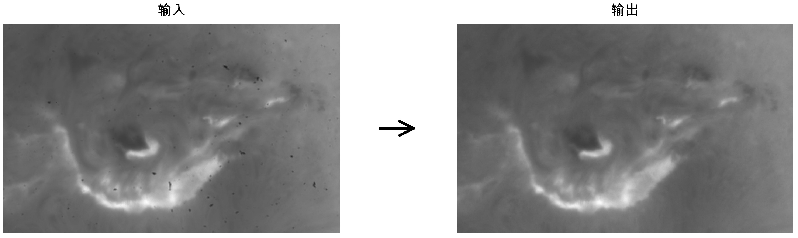
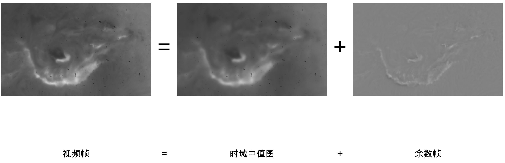
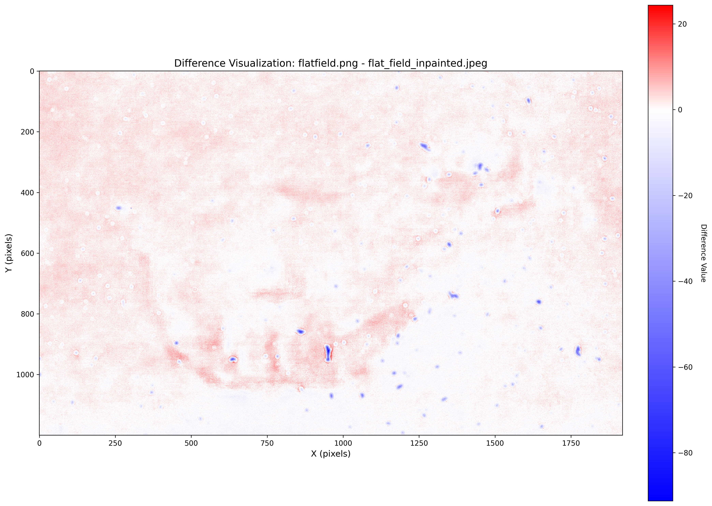
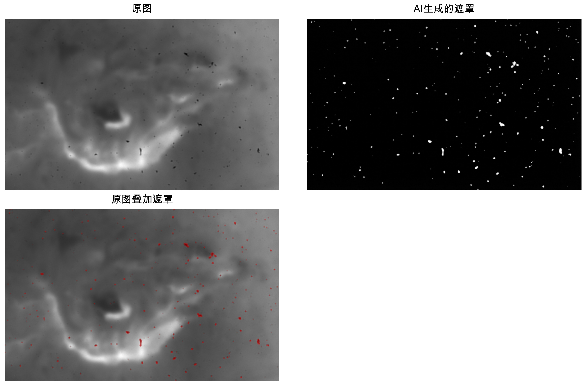
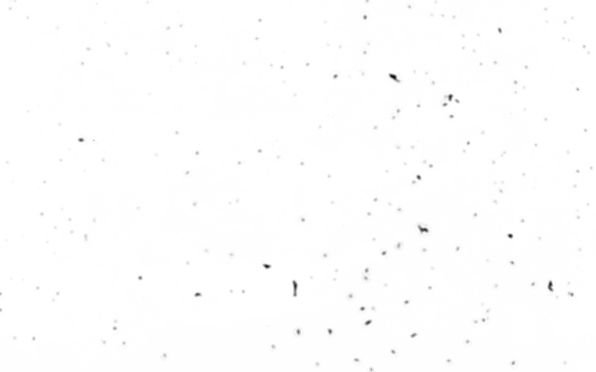
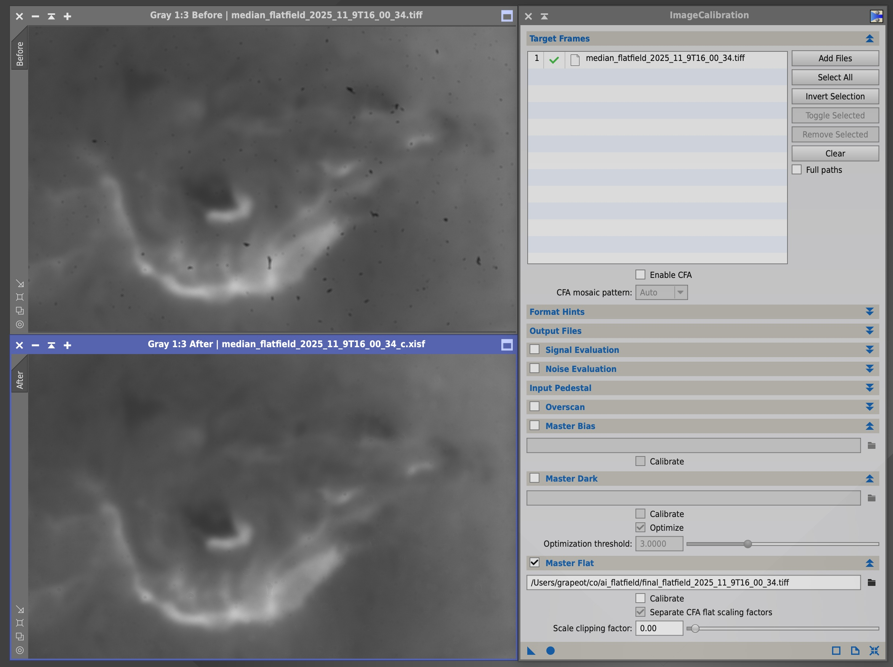

Title: 使用AI生图助力天文学观测摄影
Date: 2025-12-26 22:00
Category: Compute
Tags: Chinese, Astrophotography, AI
Slug: ai-flat-field
Summary: 探索用生成式AI解决天文图像中CMOS灰尘去除难题。通过让AI生成灰尘遮罩而非直接修复图像，结合确定性数学平场校准，实现既保留科学严谨性又获得AI强大效果的工作流。

一切都缘起于深圳市天文台德铼老师给我的一段日面摄影的视频文件。他们的设备因为一些原因，CMOS积累了很多灰尘，同时在观测太阳时，使用了f/40焦比的望远镜，这让这些灰尘在视频中尤其明显。他想知道有没有什么方法能从视频中去除这些灰尘。比如类似下图，左边是输入的一个视频帧，用一些算法得到右边的输出。

我做了很多尝试，发现这是一个很棘手的问题。这些灰尘离CMOS不是特别远，焦比又很大，所以没办法像主镜上的灰尘那样用平场直接抠干净。但它又不是特别近（可能在UVIR滤镜上），所以不是一片死黑，不能用一些很简单的亮度规则抠出来。我试了最经典的日面自举平场算法比如KLL (Kuhn, Lin, and Loranz, 1991)，但可能因为当天视宁不好，最终的效果并不好。我又尝试对整个视频取中位数，得到一个时域中值图。这样确实可以把每个视频帧分解成一个含有所有灰尘的时域中值和一个余数帧，但中值帧里面除了灰尘以外还混进去了很多太阳的低频结构。如下图所示。所以这种校准方式是错误的。

在我打算放弃的时候，突然想起来有没有可能用一些生图AI模型比如Nano Banana Pro试一下。我们给它一个视频帧，告诉它这是一个含有灰尘的日面摄影图像。让它直接输出移除灰尘之后的图像。注意这种用法和传统的机器视觉算法是很不一样的。传统算法往往分成很多步，比如像我们上面取中位数，再写一些规则用亮度把暗斑拿出来，再写一些规则根据它的形态判断哪些是灰尘。但 AI 的思路是端到端的，输入是一张图像，输出是另一张图像，只有这一步，没有中间过程。我们只需要用自然语言描述最终想要的东西是什么就好。

意识到我们可以用这种端到端的思路之后，我简单写了一个提示词，然后发现肉眼看上去效果特别好，如最开头的图像所示。这个图就是用Nano Banana Pro生成的。

然而这个结果虽然看起来好。但定量研究以后我发现它的问题很大。首先它虽然看起来和原图很接近，但如下图所示，如果我们真的用数学工具去分析的话，会发现它其实做了很多其他更改。图像的局部亮度变了，也多了一些不存在的纹理。这些变化在原始数据上可能不明显，但后期如果做了剧烈拉伸/反卷积的话，很容易出现一些明显的瑕疵。甚至如果用这样的数据去做科研的话，可能有不小的误导性。有可能我们以为有了什么重大成果，最后却发现它只是AI校准过程中的引入的不存在的纹理。

这个发现让我们在短暂的激动之后又一次陷入了死胡同。一方面是传统的算法，它从非常基本的物理规则出发，不会引入不存在的纹理。但同时它不够聪明，分不清哪些是灰尘哪些是太阳黑子。换言之，它安全但是眼瞎。相比之下，AI这种端到端的算法眼尖但是手滑。它确实可以有效地分辨灰尘，但是它修图的时候喜欢随手添加纹理，破坏科学性。所以我们的核心矛盾就变成了：有没有一种方法能够结合二者的优点？我们既要AI的识别能力（眼），又要传统算法确定性的像素操作（手）。

如果我们仔细看一下 AI 这种端到端的思路到底干了什么事情的话，会发现它同时做了两件事：第一件事是定位（眼看），分辨出来灰尘在哪里；第二件事情是校正（动手），对于灰尘的这些像素，它的像素值应该怎么改。现在因为我们耦合了这两个任务，让它一把输出最后的结果，所以我们丧失了可控性。所以一个非常直观的思路就是把灰尘定位和平场校正这两件事情分开。第一步，先让 AI 只做定位这件事。如果这一步它能做得很好的话，我们下面就可以用数学的方法去限制它只对这些灰尘动手校正。所以接下来我做了另外一个实验，修改了 AI 的提示词，让它输出灰尘位置的遮罩（1表示有灰尘，0表示没有灰尘），而不是校正后的图像。

结果如上图所示，可以看到它的效果惊人的好，基本上完美命中了所有的灰尘，避开了所有的太阳结构。我觉得就算让我用 Photoshop 一个像素一个像素抠的话，可能抠完半个小时，效果也不会比它更好。

考虑到这个质量，单单是这个遮罩，对科研来说就已经有了巨大的意义。这就意味着我们在后续的分析中，就应该把这个遮罩里面白色的像素给排除掉，它们不应该被当作太阳的一部分来处理，不应该影响照片其他部分的统计特征。所以从科研的角度来说，这个任务到这里已经结束了，我们完美地解决了灰尘去除的问题。

但这件事背后还有两个很深刻的意义。

第一是，从有很多灰尘的照片到灰尘的遮罩，这是一个典型的不对称任务。具体地说，如果你有了一个遮罩，你去判断这个遮罩对不对是一件很容易的事情。像我们做的这样，叠加一下，人看个半分钟一分钟，就知道它质量好不好。但是想从原图人工标注一个遮罩出来是非常繁琐困难的。像这么多灰尘的一张照片，怎么着也得半小时。AI 在这里的一大作用，就在于把原图到遮罩的最难的部分给极大地加速，把这个不对称的任务给变成对称的了。从原图生成遮罩的问题，只要过一下AI，就变成了验证这个遮罩好不好的问题（大多数时候都是很好）。验证完了以后，我们就能够非常放心地继续后面的处理流程。这是一个不需要改动我们已有工作流，立刻就能用上的几十倍的效率提升。

但是它真正的意义和还要远远大于省的这半小时标注的时间。像我们上面分析的，灰尘去除有两种大的思路。第一种是类似KLL这样，纯粹从物理和数学出发，利用手写的规则和启发式搜索来完成任务。它确定性高、可解释性强，但往往效果不好。

另一种方法是从2010年代开始，深度学习在天文学界逐渐流行。像流星检测、月面环形山检测甚至星空解析等等领域都出现了基于深度神经网络的方法。这些方法效果对比传统的方法往往是碾压性的，但它同样有着巨大的缺陷：要大量的数据、算力，博士水平的研究人员搭配编程很厉害的工程师才能玩得转。对应我们这个具体的项目来说，我可能需要先人工标注几百几千张类似的灰尘图像和对应的遮罩，然后在这个基础上训练一个深度神经网络。无论是数据的采集标注、模型的训练和调优，门槛都是特别高的。包括学术和工业界在内，整个天文学领域能把整套流程走通的单位寥寥无几。

但是我们回头看看，在上面这个AI遮罩的方法中，我们到底做了什么？我们把我们想要的东西（灰尘对应的遮罩）描述给AI听（就是提示词），然后按了一下回车，花了几分钱调用了一个API。然后就得到了可以媲美深度神经网络的结果。这一下就把门槛降得特别低。以前需要博士带队、显卡集群和数据标注的顶尖项目，现在只要你能用中文把灰尘的遮罩这件事情说清楚，就能做到一样的效果。基本上所有公司/单位都能做到。这是一个非常革命甚至可能导致领域剧变的事情。

但是故事到这里还没有结束。虽然遮罩对于科研来说已经够好了，但如果我们可以忍受非常局部的纹理添加，把这部分被挡住的灰尘做一个 inpainting，去想象一下这些被完全遮挡住的信号是什么样的，这对于不追求绝对严谨的摄影来说也是非常有用的。

为了实现这个目标，我们用了一些数学，生成了一个用来校准灰尘的合成平场，如下图所示。具体地说，我们用AI生成的含有脑补内容的图像，除以含有灰尘的原图，得到了一张平场。然后把它不在灰尘遮罩里的像素全部置成1.0。

因此，这个平场只在前面遮罩中有灰尘的部分才不是 1.0，其他地方像素值一律是 1.0，也就是做平场校准的时候不改变原图的像素。通过这种方式，我们就可以保证这些对图像纹理和亮度的改动只发生在有灰尘的地方。同时这个校准的过程也不是由 AI 完成的，而是由确定性的软件，比如 PixInsight 完成的。校准效果如下图所示。

这个合成平场就是我们整个项目的最终输出。我们只要把这个平场给PixInsight，它就可以把多个视频一把用平场校准的方法来去除灰尘。这个合成平场也完美地解决了我们前面的种种碰壁和挣扎：端到端的AI最大的问题就在它可能会幻觉，可能会手滑。但是通过这样一个绝大多数像素点都是1.0的合成平场，我们用数学限制了AI的缺陷，保证了它在灰尘以外的像素上没有任何手滑的机会，保证了结果的科学性。

在这个工作流里，AI的角色从一个拿着画笔随意创作的画师，变成了一个被我们严格约束的工程师。我们利用了它的视觉理解能力，让它去干找灰尘这种对人类来说太繁琐、对传统算法来说又太难的脏活累活。我们利用了它的上下文推理能力，让它去帮我们估计如果没有灰尘，这个仪器的响应应该是什么样的。但是最终进行校准、决定像素值的仍然是我们手中确定性的工具——PixInsight。这种AI生成中间件+传统算法执行的模式，我认为是当下天文摄影乃至科学图像处理中一个非常值得探索的方向。它保留了科学所必须的可解释性和可审计性，又带来了生成式AI的惊人效果。

也许在未来，这种工作流的设计、对不确定性的约束和与AI沟通的方法，会变成天文摄影乃至天文学最值钱的技能。

PS：为了验证这一整套思路的可复用性，我将整个项目开源到了 GitHub。[https://github.com/grapeot/ai_flatfield](https://github.com/grapeot/ai_flatfield)

