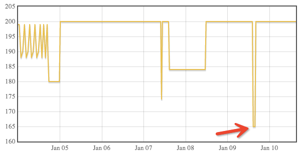

Title: Attempts to make money from BF deals and lessons learned
Date: 2014-01-10 15:15
Category: Alive

Black Friday comes and goes.
This always seems a good time to stock (or over-stock) stuffs with all kinds of sweet deals.
But instead of spending money (possibly more economically), why not just make some money from the deals?
In this post, I'll introduce my experience in trying to make money from the BF deals, my lessons learned, with some utility code to share.

## Fulfilled by Amazon

Buy low and sell high is the basic principle of making money from deals, while Amazon and eBay are two popular places to sell.
Both of them charges sellers a not-so-little fee for using their platforms, which may exceed people (at least me)'s expectation.
For example, for my $170 SSD, Amazon charges $18, while I used their [`Fulfilled by Amazon`](http://services.amazon.com/fulfillment-by-amazon/boost-revenue-with-fba.htm) service.
But from my experience with Amazon, it *is* a hassle-free and efficient way to sell your stuffs.
What you need to do is just to fill a form online, print the labels, throw the (original) package (which you got from the BF deals) to the local UPS/USPS, and wait for the money to come in.
For the two transactions I had on Amazon, it only took several hours before someone bought it. 
It makes sense because with the `Fulfilled by Amazon (FBA)` service, your customers can also enjoy Amazon perks like Prime Shipping and easy returns.

## Pitfalls in the seller center

But I have to say, the online interface as well as the beneath working mechanism of Amazon Seller Center is very confusing, which made me lose about 40% profit in my sub-400 dollars' business.
I write my experience here, hoping to warn others about these pitfalls.

The working mechanism of `FBA` is, you fill in a price, ship your good to Amazon, and then they will add your stuff into their inventory as if it's sold from Amazon.
But one critical step is, your stuff can be sold *before* your shipment get officially checked in (i.e. when you received an email saying that Amazon checked in your shipment).
I made the mistake of raising my price right after receiving the email, while finding Amazon's "official" price also went up. (I was selling an SSD)
And that day, I was notified my SSD was sold with the old price.
After several rounds of email with the customer service, I finally found out the order occurred one day before, when my price was still low.
It could be really annoying when you received notifications that something was sold with the *old* price *after* the price change.

Another lesson I just learned is some important facts:
1) When something is sold, it will *NOT* disappear in the inventory list.
2) Actually it will still stay on top of the list (I guess Amazon is just ordering them in time).
This will become extremely confusing when you have some identical things to sell. 
Which one to change when you want a different price?
The second mistake I made is, I changed the price of a finished order (how can that be allowed in the interface Amazon?), instead of my active one.

Pricing is pretty tricky in the seller center. 
Setting the right price as early as possible, to the right item, is where you should spend time on when doing business on Amazon.

## Monitoring the price

In order to help monitor and visualize the price, I developed a small utility [[github]](https://github.com/grapeot/AmazonPriceMonitor/), which uses a `phantomjs` script to crawl/parse the script and uses `flot` with `nodejs` to support a visualization webpage.
Unfortunately, this utility successfully detects my price mistake, when Amazon received my shipment and updated their price to an unusually low one...

T_T
