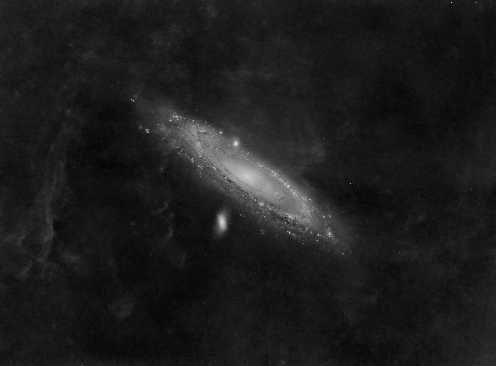
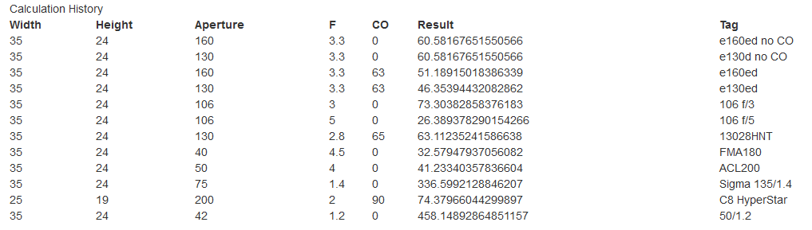

Title: 如何选镜子来最大化信噪比
Date: 2021-09-05 13:30
Category: Life
Tags: Chinese, Astrophotography, Tutorial
Slug: astrophotography-snr-telescope

一切缘起最近一个对M31的实验。最近才知道，原来在M31附近是有一些Ha云可以拍出来的（dalao说是银河系内的，具体是什么暂时不深究）。但这玩意非常难拍。我用中黄曝了25个小时Ha，2x2马赛克接片搞出来了这样的效果：

这对我的震撼很大。原来一直以为M31附近Ha是空荡荡的，拍Ha通道只是为了小红花而已。结果发现原来一块地方只要一直曝光，很可能都是可以拍出来一些东西的。这一方面让我对全天Ha马赛克有了更大的热情（以后详聊这个项目），一方面也让我找到了天文摄影方面的风格：这种超长曝把云气曝出来实在是太酷了。但这紧接着就带来另一个问题，什么样的镜子适合拍这样的题材呢？或者说，什么样的镜子可以最大化信噪比呢？

可喵写过[一篇文章](https://crazygame12345.github.io/viewpoint/ewExternalFiles/note-add1.pdf)，从数学角度系统透彻地分析了这个问题。基本结论是，一个天体每角秒的信噪比，与口径成正比，与焦比无关。我非常赞同这个观点。一个直观的理解是，比如一个镜子原来是100mm口径，f/5.6，全幅。加了个减焦变成了f/2.8，M43画幅（裁减系数2.0，正好是全幅传感器的1/4面积），视角不变（其他因素也不变比如相机QE）。在这种情况下，后者的图像更亮了，但也更小了。如果把全幅和半幅拍出来的照片都放到同一个显示器上面全屏显示，半幅的图要放大更多倍才能充满屏幕，所以一正一反，定量计算以后信噪比其实是一样的。（这里面其实忽略了一些细节，比如读出噪声和像素大小存在非线性关系，但不影响本文的讨论）。所以加减焦镜或者增倍镜一般不会增加信噪比，这种情况下镜子就是越大越好。

从另一个角度来看，如果我们固定焦比，放大口径，这个结论还是成立的。比如我们有个100mm口径f/2.8的镜子，接一个半幅相机（A系统）。如果我们把整个系统放大2倍，变成一个200mm口径f/2.8的镜子，接一个全幅相机（B系统），那么拍出来的照片视角不变，亮度不变。但因为现在是全幅了，如果把这个B系统的照片和半幅的A系统的照片放在同一个显示器上面的话，全幅只需要放大更小的倍数就可以充满屏幕，所以信噪比其实升高了。或者换一个角度说，100mm的A系统拍4个小时，才顶200mm的B系统拍1个小时。

然后坑来了。这个结论仅仅适用于天体很小，不会漏到传感器外面的情况，不能直接拓展到[接片](/gigapixel-panoramas.html)上。比如我们在上面的例子，用200mm口径f/2.8的镜子，接一个半幅相机而不是全幅相机（C系统），这就坑了。相比于全幅，这种情况下3/4的光其实漏掉了。它的确成像了，但因为传感器太小了，没被接住。所以这时候视角不同，亮度相同。如果接片的话，就需要接4个panel才能接到原来的视角。所以这种情况C系统拍4个小时，其实也相当于B系统拍1个小时，或者A系统拍4个小时。口径大了是大了，但没用上，白瞎了。

这个只是直观的例子，如果要定量计算的话还需要考虑其他因素，比如中央遮挡等等。我做了一个计算器，可以供大家参考: [https://lab.grapeot.me/calc.html](https://lab.grapeot.me/calc.html)。下面也列了几种比较流行的广域设备的计算结果。注意这里面没有考虑量子效率，读出噪声，接片的overlap等因素，完全是从光学的角度来看。输出的结果是一个相对的效率值。如果一个系统A是系统B效率的2倍的话，就相当于系统A曝光1个小时然后接片，会得到系统B曝光2个小时然后接片的结果。

所以如果总结一下结论的话，等于是给可喵接了后半句。如果传感器能兜下整个拍摄对象，每平方度的信噪比仅和口径有关，和焦比无关。如果传感器兜不下整个拍摄对象比如要广域接片，每平方度的信噪比仅和焦比有关，和口径无关。当然这个结论只是抓了主要矛盾，真的[选镜子](/astrophoto-tutorial-4.html)的时候还要考虑这些因素：

* 传感器大小。传感器越大，效率直接和面积成正比地升高。
* 传感器量子效率。比如4040比16803虽然面积相似，但效率（和价格23333）都要高很多。
* 中央遮挡。比如从RASA8到RASA11，虽然焦比不变，传感器大小不变，但相对的中央遮挡减小了，所以效率还是升高了。
* 分辨率。在视宁度允许的范围内，口径越大分辨率越高。用个50mm/1.2拍，效率高得吓人，但稍微一放大就是糊的，也要根据实际需求斟酌。
* 星点。相机镜头往往有两个问题，第一无穷远处像差纠正并非完美，成像圈边缘星点拉胯；第二光轴调教也不像望远镜厂商那样精细，有时候会歪轴，全幅尤其明显。所以也不是就无脑买135/1.4就好。
	
所以我觉得如果真要搞这种巡天的话，巨炮其实没用（那是拍小天体用的），多炮才是王道。搞几个碳纤维快镜，Side by Side架在一个赤道仪上，用Voyager控制，感觉会很爽。

PS: 这个计算也是我自己琢磨出来的公式。如果有问题欢迎讨论指正。

