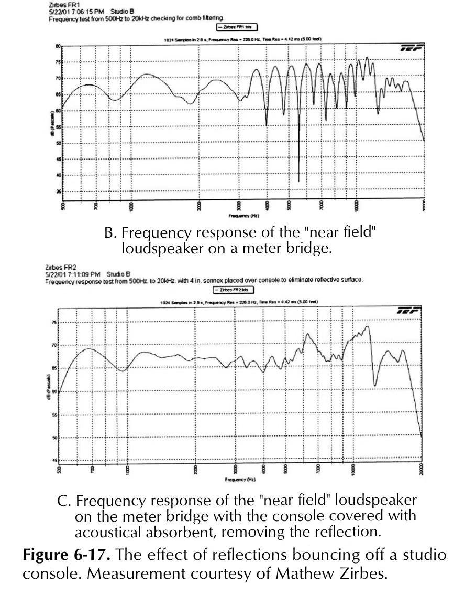

Title: 音频碎碎念（五）—— 听音环境
Date: 2022-12-25 19:00
Category: Life
Tags: Sound Engineering, Chinese
Slug: sound-engineering-5-environment

---

本文是《音频碎碎念系列》系列的一部分：

* [音频碎碎念（一）—— HiFi科学派](/audio-1.html)
* [音频碎碎念（二）—— 响度的玄学](/audio-2.html)
* [音频碎碎念（三）—— 频率的玄学](/audio-3.html)
* [音频碎碎念（四）—— 线材的玄学](/audio-4.html)
* 音频碎碎念（五）—— 听音环境（本文）
* [音频碎碎念（六）—— 模电](/audio-6.html)
* [音频碎碎念（七）—— 放大器](/audio-7.html)
* [音频碎碎念（八）—— 放大器输出级](/audio-8.html)
* [音频碎碎念（⑨）—— D类放大器](/audio-9.html)
* [音频碎碎念（十）—— 地狱听音环境实操](/audio-10.html)

---

今日Hifi玄学：（录音工作室和我们听音乐的）应该如何布置听音室？这也是个有很多研究的领域，科学家们从几百年前的教堂设计就开始探索，一直到近年仍有进展。基本观察是，[听音环境非常重要](/sound-engineering-10-real-example.html)，烂音箱+好听音环境可以干掉好音箱+烂听音环境，好听音环境甚至可以突破音箱物理极限。玩箱子的话，最重要的一步可能不是改善音频系统，而是从头修建或者装修已有的听音室。

1. 这一切都是因为声音的反射和叠加。一个同频率的声音在反射后可能会迎面撞上自身叠加。叠加以后可能会形成驻波也可能不形成驻波。不形成驻波的比较好办，下一个时刻它的叠加情况又变了，不会有持久的影响，就是普通的回声。形成驻波的比较麻烦，取决于声音的相位，这个频率的声音在听音者的位置可能完全消除，也可能会被增强。这就等于套了一个巨大的滤波器。比如想象一下你坐的位置正好听不见1000Hz的声音，那整个人声就废了，100万的音箱也没用。这是为什么听音环境很重要。比如附图中，上图是一个房间里面测出来的音响的频率响应，下图是做完消音以后它的频率响应。上图因为驻波的干扰，非常诡异。(图片来自Handbook for Sound Engineers)

2. 那我们要用什么数学工具去描述驻波呢？其实就是最简单的comb filter。我以前学DSP的时候一直不懂这破玩意有啥用，直到看到这个驻波形成的过程才感性理解为什么回声在频谱上是一个梳子一样的形状。一个屋子，只有特定波长（频率）的声音才能形成驻波，这叫做这个屋子的mode。有了这个参数就可以测算出来整个屋子相当于一个怎样的滤波器（EQ），会对声音有怎样的影响。而且调整了。
3. 怎么调整呢？我们能用的武器主要是反射，散射，和吸收。通过在屋子的不同地方贴上不同的材料，就可以改变这个房间的EQ。音响和家具的摆放位置和方向也是非常重要的。但里面一个东西是很难改的，就是房间的尺寸和形状。房间的尺寸决定了会形成驻波的声音的频率。这是为什么如果真的想要大幅改善听音效果的话，最好的方法是从头设计一个房间/房子。
4. 有了武器，我们想要达到什么样的目标呢？一个非常直观的问题是，既然反射这么不好，我们就照着电视里面那种消音室贴消音材料不就好了？这里面有两点原因，第一个是电视里面也提到了，这种消音室非常可怕，人在里面呆几分钟就可能崩溃，更别提在里面放松享受或者严肃听音了。第二个是，虽然的确监听室是用类似的思路建立的，但监听的思路是尽可能暴露出录音中的瑕疵，这样可以及早修正。大多数人其实不想要这样的效果，他们想要的是即使录音有瑕疵，听起来还是好听的。就类似单反拍照可以把模特毛孔全都拍出来，但这么拍妹子直出估计会给打死。那具体怎么样可以美颜呢？这个是个非常大的话题，举两个例子。一个是通过调整房间的大小，让它在120Hz左右有一个mode（形成驻波），这样音响的低音会变得非常"醇厚"；一个是通过加装反射和吸收材料，让听音位置可以听到10ms左右延时的水平方面的回声，但是抑制竖直方向的回声和多于10ms延时的回声，这样可以极大拓展音响的声场。让人感受到的声场远远超过两个音箱之间的距离。这些都是双盲验证过的结论。

看来玩箱子还是得自己先盖房子。。（然后这个书花了几百页讲怎么盖房子。。从地基到砌墙，从教堂到歌剧院，各种设计，施工让装修要领。。）