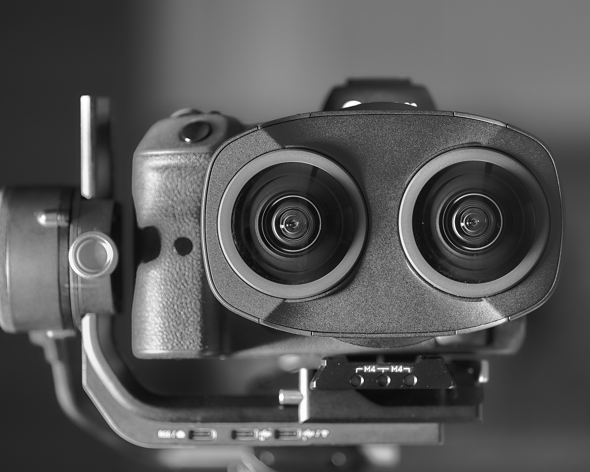

Title: 如何使用佳能EOS VR镜头进行创作——前期手法与后期流程
Date: 2022-05-02 00:19
Category: Computing
Tags: Photography, VR

最近购入了佳能EOS VR镜头，非常惊艳于它的表现能力。但这也是一个相对新的产物，包括前期和后期，有很多新的东西需要学习，我也经历了相当的一段摸索过程。借这个文章，把一些心得和创作的工具总结分享出来。如果你目前没有VR镜头但是对这方面感兴趣，不妨收藏一下。我有信心这是目前中英文全网最早最深刻的VR镜头的使用指南之一。

从普通镜头转到VR镜头的体验和从变焦镜头转向定焦镜头，尤其是广角定焦镜头的体会非常相近。最明显的区别就是多了很多限制：（普通）广角镜头景深过大无法强调主题，视角过大很难排除背景。在用了一段时间以后会发现咦好像也有一些别致的用法，比如广角的透视形变拍狗脸大鼻子照，多张鱼眼全景接片，别的镜头都搞不出来，这是猎奇的阶段。继续用一段时间以后才发现这种镜头有自己适合的独特场景，这种场景未必是第一眼看上去的大头照，全景接片之类浅显的应用，而是有更深层的规律。比如广角的用法不是把所有东西全都收进去，而是（其中一种用法是）在狭窄的空间营造纵深感。类似的，VR镜头的使用也有猎奇和针对场景的两个阶段。

从猎奇的角度来说，VR镜头最明显的就是无与伦比的临场感。这种临场感主要是通过前景和背景的分割来营造的。这里的分割不靠虚化，主要靠双目视觉的视差。所以如果想要放毒种草，给客户留下良好的第一印象的话，可以用这种前背景的分割来营造wow的感觉。具体地说，我们可以选择前背景拉得很开的场合，站得离前景比较近来拍摄。或者拍摄一些本身就很有纵深感和包围感的前景。比如一颗立体的树，人站在下面拍摄，这样整个树延伸在前方和上方，本身的纵深跨度也很大，非常震撼。人物的合影也是比较适合的场景，此时可以让人物摆出有纵深感的pose，比如向着相机举手摆pose（而不是向着身侧摆）等等。

但这样的特殊应用毕竟有限，所以很快就会进入到第二阶段。也许说之前的是“猎奇”略显刻薄，这一阶段其实还是会用同样的技巧，但会以它为手段而不是目的来拍摄，最终的目的还是摄影里面更本质的要素。基于视差的前背景的分离虽然有wow的效果，但与基于虚化的分离没有本质区别，使用方法也类似，因此最多是一种技术，很难说是为了虚化/视差而拍照。从服务于目的的角度来说，我觉得VR镜头主要有以下几个核心优势：

第一，视野极广，有助于交代复杂甚至宏大的叙事。一个例子是，我在拍家庭旅游照的时候发现，一个镜头往往可以交代出很多信息。比如画面的中央是爷爷在拍照，循着爷爷的镜头看去，是奶奶和老妈在逗娃。妈妈手指向天空，好像在跟娃介绍什么。往手指的方向看去，原来是一架飞机飞过。整个故事就交代得完整且条理分明。普通的广角镜头画面周围的透视形变往往会让画面非常怪异，所有的要素集中在画面里也非常凌乱。但VR镜头因为观众的视野有限，不会有透视形变的问题，同时有自己转头探索的过程，所以也不会有凌乱的感觉。这是VR这种表现手法的独特优势。

第二，VR镜头额外引入了一个维度——不是深度，而是角度。深度是虚化时代就有的东西，没有太大创新。但角度是个非常新颖的东西。想象一下如果你想表现一个东西很高，很大，有压迫感，会怎么拍摄呢？以前我们可能会用广角，或者手机可以用接片，把整个东西收到一个画面里。或者对摄影比较有了解的法师们会选用长焦，在远处拍摄，通过和周围的人的对比来表现建筑等物体的庞大。但这些手法且不论表现力如何（比如我看着手机的接片一长条，完全无法直观感受到这个东西有多高），和我们的真实感受相去甚远。想想我们是怎么感受到一个东西很高的？“头一直往上看，帽子都掉下来了。”小学作文就常用的一个桥段，其实说的就是——我们是通过抬头的角度来感受到的。可惜的是，除非打印成十几米高的照片，普通的照片完全丧失了这个维度。但VR里面因为要想看到上面的东西也要抬头，所以还是有这个维度的。即使是很普通的一张VR照片，也可以轻松传递物体的维度。这对于某些主题来说是一个有力的武器。

VR镜头这两个额外的信息，一方面通过视角增加了信息量（广度），一方面通过加入角度这个额外的维度增加了信息的多样性（深度），全方位拓展了照片的表现力。这也是为什么大家觉得VR有临场感的原因。所以我觉得这是摄影上一个非常革新的技术手段。当然这个手段也有很多弊端，比如观众很难控制，这在电影等工业里可能尤其是个避讳的东西。具体如何使用，我也还在摸索中，也欢迎大家讨论。

明确了前期的技法要点，接下来我们探讨一下VR的后期技术和工作流程。考虑到VR镜头，尤其是EOS VR镜头是个非常新的东西，这样的讨论非常重要。其实我有一肚子槽要吐，主要是佳能的那个软件实在是太鸡儿难用了。主要槽点有：

1. 2202年了，不论是视频和照片，一律不支持RAW，“一起来做直出大法师啊！”
2. 2202年了，软件写的跟90年代一样，一做计算UI就卡死。关键是8k的数据本来就大，程序写的又是一核有难，15核围观的风格，随便点个鼠标就要卡半天。比如想导出5张照片，我需要点一下照片，卡1分钟，勾选“地平线纠正”，卡1分钟，然后重复5遍以上操作。也就是有10次等待。说到这我突然懂了为什么不支持RAW了，用jpg都要卡半天，用RAW还不得卡到下世纪去。
3. 算法感觉还是有点bug。即使把视差纠正和地平线纠正全部钩上，物体离得近在VR眼镜里面就要斗鸡眼，过分偏离中心斗鸡眼，很多时候看的就是不得劲。
4. 这个不能算是软件缺陷，只能说是系统痛点。8k的分辨率对双眼180度VR来说还是不够高。因为每个眼睛分到4k，这4k需要覆盖180度的视角，一摊下来就不够了。所以我们需要一些方法来增强分辨率。我用的是Topaz Sharpen AI，但我试了PS等软件也有类似效果。

但这里我不打算介绍怎么惯着佳能，用这个屎一样的软件每个月还要交5美元才能处理2分钟以上的视频（不过话说这个界限把握的还是蛮好，像我不是专业VR作者，就基本上不拍2分钟以上的视频。但想想他们以此为生的应该不会不拍）。我打算扬眉吐气地告诉你（插腰），我自己写了个python脚本，解决了以上所有问题，并且开源了。脚本的地址在这里 [[github]](https://github.com/grapeot/EOSVRConverter)。注意这目前还不是一个成熟的软件，而需要使用者有一定的python基础，可以阅读和修改code。

下面介绍一下后期的工作流程。对于图像来说比较简单，我们不用像佳能官方说的那样一定要用机内直出，可以直接把直出关了，只用RAW。然后把RAW文件在PS/LR/C1等软件里面正常处理，导出一个jpg，然后用EOSVRConverter.py转换成VR眼镜可以渲染的180 SBS照片即可。核心在代码里面的
correctAllImages()函数。在处理完以后，可以选用Topaz或者PS批量做一些锐化。

视频的话稍微复杂一些，主要我的工作流里面需要先把视频转换成图像，然后转成180 SBS格式，做一些处理，然后转回视频。具体地说，如果需要使用RAW（输出佳能专有格式而不是mp4）的话，需要先用Premiere等软件解码+color grading+调整，然后转成mp4。如果不使用RAW而是机内直出mp4的话，即使使用了CanonLog，我的工具也可以帮助进行解码，color grading，和自动的一些色彩调整。接下来不论用不用raw都是正常的180 SBS转换。然后videoCombiner.py会调用多个Topaz Sharpen AI实例来进行批量锐化，最后调用ffmpeg来合成视频，包括加入原先的音频。整个流程几乎不需要用户交互（Sharpen AI需要点一个Apply按钮），高度并行，而且（间接）支持RAW和CanonLog。

目前这还是个脚本，需要用户有python经验，装有ffmpeg等。如果有同学有兴趣一起把它做成一个软件的话，也欢迎加入哈。此外，我对如何使用一般的相机进行3D拍摄也有了一些实验，比如如何用超长基线（就是相机的瞳距）来让风光片也有3D效果，也在开发一些工具，让佳能的这个VR镜头可以可靠输出360度的3D全景照。这对于虚拟看房等领域应该有很大帮助。欢迎各位拍砖讨论。