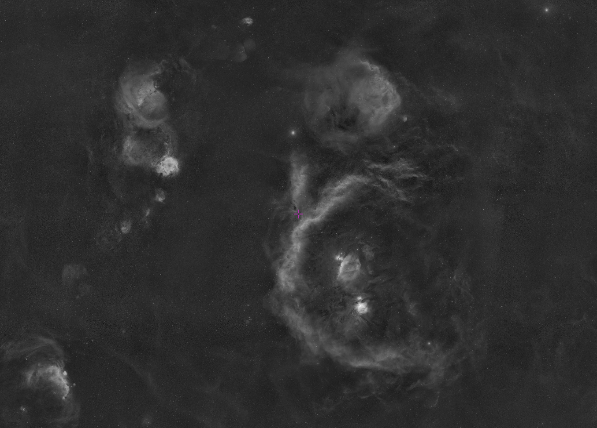
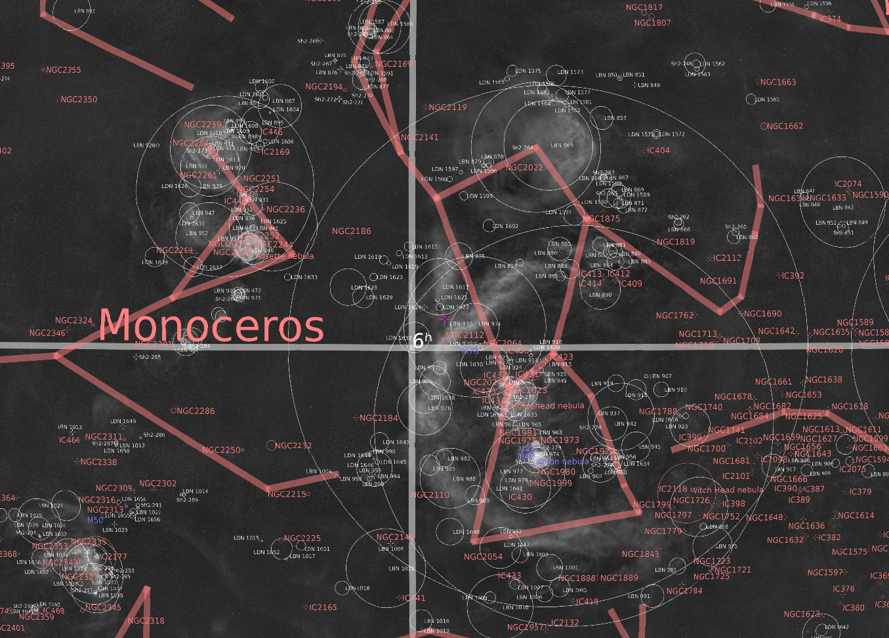

Title: 鸭阵巡天
Date: 2022-03-27 18:05
Category: Computing
Tags: Astrophotography, Sky Survey, Chinese
Slug: duck-sky-survey

身处一年下一场雨，一场下半年的西雅图，我有很多有意思的天文摄影想法都没办法实现。自从去年11月开始接触在云南的远程台，终于有了足够的晴天和暗空环境。在花费200多小时拍了一些新手村目标比如[M31](https://www.astrobin.com/fnoihw/)和[M42](https://www.astrobin.com/c7romg/I/)以后，我终于寻求到了足够的器材上的支持，可以进行一些更有意思也更长期的项目，比如鸭阵巡天。

这里是鸭阵巡天的网站：[https://yage.ai/dss/](https://yage.ai/dss/). 顾名思义，它是一个巡天项目，最终的目标是用Ha通道和RGB通道拍摄全天的天体。目前的结果覆盖了180度赤经和120度赤纬，也就是全天1/3的天区。目前只有Ha通道的结果，因此是黑白的。因为我们基于现有的星图对巡天数据做了精确的对齐，这个网站提供了很多丰富的功能。一方面，我们可以用两指或者鼠标滚轮放大缩小，单指或者鼠标拖动来平移，一方面，在左上角还有一个按钮Toggle Annotation来显示或隐藏标注，如下图所示。这个网站也支持搜索功能，单击放大镜图标，就可以输入想要查找的对象名称（比如M42），按回车即可直接跳转到对应位置。

这个项目有什么价值呢？首先，现有的巡天数据大都是科研用的，对摄影很不友好，比如有明显可见的接片边界，炫光严重，信噪比不高，很多深空对象看不清楚，不方便构图。如果有这样一个HaRGB通道的高质量的巡天数据，对深空摄影的规划会很有帮助。然后，这个项目不仅仅是巡天本身，我正在把它往一个众筹项目的方向推动，这可以带来无限的想象空间。比如，我一个人拍摄整个星空是很困难的，但如果我们让大家用自己的器材加入进来，输入自己的器材参数和地理位置，然后用一个NINA插件从一个网站上一键下载一个针对今晚的高级序列，最后把采集到的素材上传。这样可以极大地加速项目进展。再比如，如果构建了这样的一个巡天团体，我们就可以和专业的天文社区合作。因为很多天文科研并不需要高精尖的设备，爱好者的业余器材其实绰绰有余。所以我们可以承担他们的一部分观测任务。对他们来说，他们可以在短时间内采集到大量的数据，同时成本可能也比自己买器材自己观测要低。对我们来说，通过众筹的方式为推动天文学的边界贡献自己的力量，也是一件有成就感也有经济回报的事情。其实我甚至觉得构建这个平台本身就是一个非常有影响力也有创新性的博士研究项目，类似人工智能领域的ImageNet。乍一看，这好像和科研没什么关系，不就是拍照片/标数据嘛，但因为很多时候科研的基石就是大量的数据，这样的平台往往可以极大地推动科学的进展，也会得到非常多的引用（比如ImageNet这个通篇一个公式都没有的论文已经有了将近4万个引用）。

当然，这也是一个非常非常困难的项目。光就巡天本身，现在就没有任何商业软件可以生成这种规模的马赛克拍摄计划，也没有软件可以处理这种规模的马赛克后期。所以我只能从头编写程序生成拍摄计划并导入NINA的高级序列进行拍摄。每天白天筛片之后，程序会根据已经拍摄的素材和目标天区，考虑到月亮的方位和亮度，重新生成今晚的拍摄计划。后期方面，也要做大量的工作。因为数据量特别大，所以需要使用特别的算法来最大化并行的程度。又因为消费级电脑的内存再大也满足不了这种几千张图的马赛克，所以只能尽可能把数据放在硬盘中来做计算。但传统的机械硬盘会特别慢，所以还特别为这个项目组了一个32TB，12GB/s连续读写速度的RAID 0阵列。总之，这是个非常有挑战性的项目，对硬件，软件，写码能力，天文知识，都有着非常高的要求。对我来说这也是一个非常有意思的学习过程。

那为什么这个项目叫鸭阵巡天呢？主要是因为为了加速巡天，它用的是一个望远镜阵列。目前这个阵列由两台锐星ACL200组成，一台装载宇隆的3nm Ha滤镜和振旺的6200MM相机，一台装载6200MC相机。非常感谢宇隆，振旺，锐星在器材上的帮助，柒妹在资金上的帮助，以及云岭天文台在技术上的支持。没有你们的慷慨帮助，这个项目不可能成为现实！如果大家对这个项目有什么想法，也欢迎在评论中留言讨论鸭！