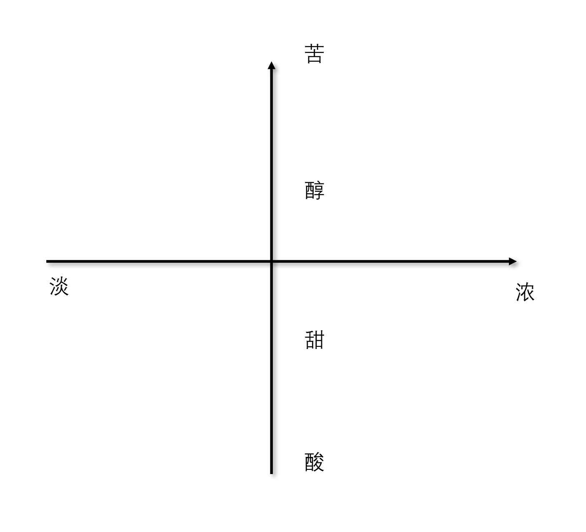

Title: 咖啡器材从观望到破产（二）——意式咖啡的工作流
Date: 2023-10-29 17:30
Category: Life
Tags: Chinese, Coffee
Slug: espresso-workstream
Summary: 用二维坐标系（浓度×口味）分析浓缩咖啡的变量控制，阐述研磨、烘焙、水温、压力、粉碗等参数如何影响最终口感，总结好设备的一致性、能力范围和精度要求。

最近在折腾烘焙咖啡豆和萃取espresso，头都秃了。
这也启发我对"当我们说做咖啡的时候，我们到底在讨论什么"做了一些进一步的思考，在这里分享一下。
但需要声明的是，我是野路子，没有接受过正规的咖啡培训。因此，对于SCA的标准理论，我并没有深入的理解。
同时以下观点主要是针对[浓缩咖啡](/grinder-tech-specs.html)，而不是手冲咖啡，所以可能存在一些局限性，希望大家能指出。

我认为，制作浓缩咖啡时，最终的口感可以用两个维度来描述。
第一个维度是它的浓度，是淡还是浓；第二个维度是它的口味，比如是酸、甜、醇还是苦。
（其实温度也是影响口感的一个重要因素，但因为咖啡一直在变凉，很难控制，所以这里暂时没放进去。）
就像在二维平面上一样，任何一杯咖啡都可以根据这两个维度定位到一个点。
而我们有很多不同的工具和变量可以影响这个点在平面上的位置。
比如，停止萃取的时间，水温，压力，[粉碗的孔径大小](/HG-1-coffee-grinder-review.html)，磨豆的粗细，烘焙的深浅，以及豆子的质量等等。

我们制作咖啡的流程通常首先是确定自己喜欢的咖啡在口味坐标上的基本位置。
例如，我个人偏好浓郁的咖啡，口味在甜和醇之间。
也有人喜欢口味偏苦或偏淡的咖啡。
确定了自己喜欢的咖啡口味后，我们就可以通过调整各种变量，采用不同的策略，使得制作出的咖啡在口味坐标上处于特定的位置。
比如，如果想要一杯偏酸且浓郁的咖啡，我们可以购买果味鲜明的咖啡豆进行浅烘，磨粉时磨得较细，采用高流量的粉碗，用低压力高温度进行萃取，当粉水比大约为1比1时停止萃取，这样得到的就会是一杯又酸又浓的咖啡。
相应地，如果我们想要增加咖啡的甜感，就可以在粉水比为1比1.5时停止萃取，同时烘焙时也要稍微深一些，以削弱咖啡豆中的酸味，从而提升相对的甜感。
每一个变量都有许多讲究，而且不同的变量之间往往是相互影响的。
例如，烘焙得越深，咖啡的细胞壁被破坏的也越多，因此在萃取时，咖啡中的风味物质会更容易被萃取出来。
为此我们需要相应地降低水温和压力，以避免过度萃取。

我们可以在后续的文章中详细讨论这些具体的讲究和它们之间的相互影响。
这篇文章里我们先从一个宏观的角度来介绍一下。
这么多的介绍，其实最终的目的是为了引导我们理解咖啡设备在整个流程中的作用。
无论是烘豆机、磨豆机还是咖啡机，这些设备的主要作用就是帮助我们调整这些变量，以找到最佳的参数配置。
要实现高效甚至可行的参数调整，一个好的咖啡设备应该满足以下三点要求。

1. 首先，它应该具有一致性（consistency），也就是说，我今天用这个设置得到的结果，明天用同样的设置也应该得到同样的结果。这种特性也被称为可重复性（reproducibility），它是我们进行合理实验比较和重现实验的基本前提。
2. 其次，设备应该具有一定的能力范围（scope），也就是说，设备应该有足够的能力来满足我们的需求。比如，我在萃取的时候想要先从三个大气压开始，持续五秒，然后逐渐升到九个大气压。如果有些咖啡机没有这种pressure profiling的功能，那么我们在寻找最佳参数配置的时候，灵活性就会受到限制。
3. 最后，设备应该具有足够的分辨率（resolution），也就是说，设备应该能够精确地调整到我们想要的参数。比如，有的咖啡机使用精密的PID算法，可以精确地调整水温到0.5摄氏度。但是，有的咖啡机的水温调整可能就比较粗放，比如前一档是93摄氏度，下一档就变到96摄氏度了。这个对磨豆机的粒度控制尤其明显。这种精确的调整对于我们寻找最优参数是非常重要的。

总的来说，一个优秀的咖啡设备应该能帮助我们找到并固定最佳的参数，让我们能够灵活且可靠地通过组合这些变量来得到自己想要的口味。
而制作出好咖啡主要取决于三个方面。

1. 首先，我们需要知道在这个二维或者多维的平面中，哪些地方的咖啡是可以制作出来的（feasible range），而且它的口味是令人愉悦的（pleasant range）。例如，在尝试猫屎咖啡之前，我都不知道最终的咖啡可以有既多变又醇厚的body。而在使用这种特殊的处理方法之后，我们可能会发现这个二维平面其实应该是一个三维或者四维的平面，有很多奇妙的组合。
2. 其次，我们需要知道如何调整这些变量以达到想要的口味。比如在我花很多时间研究浅烘的萃取之前，我没有想过咖啡可以又酸甜又浓郁（因为一般酸要求浅烘，但浅烘的豆子做意式很难高效萃取，磨细了要么channel要么彻底堵上）。但是在接触到高流量粉碗和低转速磨豆机之后，我逐渐意识到这是可以调出来的（充分degas，高流量粉碗，低转速磨豆，长prefuse）。
3. 最后，我们需要有一个设备来实现我们的想法。比如，在见识到有pressure profiling的设备之前，我没有意识到对于prefusion可以有各种灵活的控制。在了解了这些设备之后，我就有了更多的工具来调整这些参数，从而实现最终对口味的控制。

这些是我最近关于制作咖啡的一些体会。我肯定有很多遗漏或者错误，也希望大家能批评指正。

