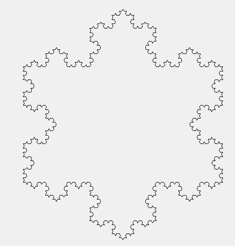

Title: F# Revisited
Category: Computing
Date: 2012-05-16 02:55

I was interested in F# because of some of its fun usages, and the ease to do asynchronous and parallel computing. Used F# to implement some domain specific language like Turtle and fractal effect this afternoon. Basically the tasks themselves are nearly the same as this post and this post, some own thoughts were inspired.

Let's first see some examples. For the turtle system, below is a command sequence (actually a linked list) for drawing a triangle:

    :::fsharp
    let koch1 = [ Fwd 243.; Right 120.; Fwd 243.; Right 120.; Fwd 243. ]
 
It's easy to understand, first draw a line with length 243 pixels along the current direction, and then turn right 120 degrees, draw another line with length of 243 pixels and turn 120 degrees again, following by the final edge with length 243 pixels.
 
What I want to emphasize is, this is a simple language, a so-called domain-specific language (DSL). It's extremely easy to implement some embedded DSLs inside F# due to its flexible syntax.
 
Let's see some amazing  sample usage of this tiny language with only 3 keywords and 1 data type. The following function takes a command sequence as input, and "expand" it as a longer one. More specifically, this function is used to expand a straight line into a certain line segment as follows:

Code:

    :::fsharp
    let kochChange drawing acc = [
        for cmd in drawing do
            match cmd with
            | (Fwd, n) -> 
                let x = n / 3.0
                yield Fwd x
                yield Left 60.
                yield Fwd x
                yield Right 120.
                yield Fwd x
                yield Left 60.
                yield Fwd x
            | c -> yield c ]

Note the parameter acc is a dummy one, making it suit the interface of List.fold below. Then We can simply draw some amazing fractal shape easily:
 
    :::fsharp
    [1..4] |> List.fold kochChange koch1
 
Note `koch1` is defined before to draw a triangle, therefore this statement expands a triangle with the rule shown above recursively, and produce a command list for the following figure:

 
The complete code is available in my github. The famous Mandelbrot set is also easy to draw with this code, with asynchronous and parallel computing enabled.
 
After this exercise, I feel more comfortable to use F# and find it appealing in the following aspects:

Lightweight yet rich type definition. New types or structures can be defined neatly and even within one line. Examples are like

    :::fsharp
    type Command = Fwd | Left | Right
    type MandelbrotResult = | DidNotEscape | Escaped of int
 
This makes the extensive usage of object-oriented style very easy. For example, use a new enumeration as place holders in DSLs, like this post illustrates.

Compact yet flexible syntax. The unique syntax like pattern matching, treating tuple as first class component makes it easy to write intuitive logic within one to two lines, while other languages may need 10 lines. For example, the following code computes the Mandelbrot iteration result of a given complex number, and return the iteration number if it's convergent, otherwise output 0:
 
    :::fsharp
    match mandelbrot (Complex(x, y)) with | DidNotEscape -> (x, y, 0) | Escaped i -> (x, y, i)

Convenient collection interfaces. F# not only supports traditional functional ones like map, filter, fold, and also lazy sequence generation. The keywords like yield makes long LINQ statements in C# like nested SelectMany and Select pretty easy and intuitive to write. An example is the kochChange function above.

Easy asynchronous and parallel programming, such as non-blocked operations, parallel operations, etc. This is clearly illustrated in Don's post.
 
Overall, F# is a pretty interesting language, lightweight, powerful, and neat. And finally I feel sort of mastering it... Will further explore its potential for scientific computing and possibly updated again soon.
