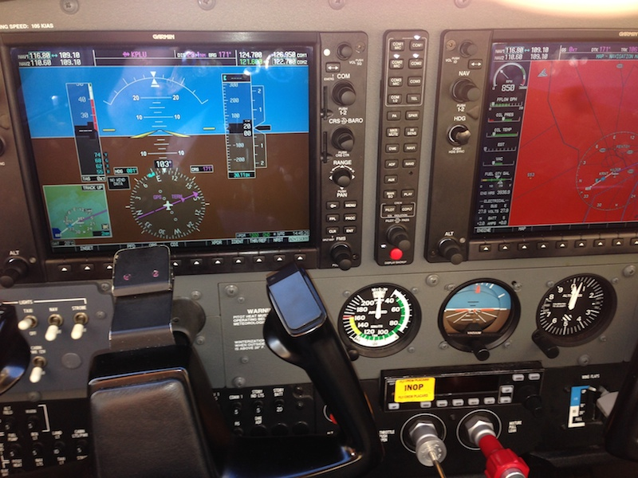

Title: FAQs to Learning to Fly
Date: 2014-10-13 08:14
Category: Life
Tags: Aviation, English

Finally got my private pilot certificate... 
Become a certified airplane pilot en.
Provide some FAQs here and hope it may help you.

### What can a private pilot certificate bring you?

I would compare it to getting a driver's license.
For example, when we hear there is a good Chinese restaurant down in Albany, OR, we simply choose a weekend, hop in a plane and fly there (from Seattle).
Everything was pretty like a road trip. 
It was shortly planned, with no need to arrive in the airport early, no long line of TSA screening, and we arrived in the city, which is 240 miles away, within 1.5 hours.
Another example is that last year, I hesitated a lot when picking up a place for a three-day trip.
Vancouver, BC finally won against San Juan islands and Olympic National Park because the latter two take five to six hours of ferry ride and/or driving.
But now, I already went to San Juan islands (FHR/ORS) and Port Angeles (CLM) for sunset and food several times, each trip less than 40 minutes one way.
It's pretty like a (much) faster car, which will simply bring more possibility.

### How much does it cost to rent a plane?

Most of us still cannot own a plane right now, although actually that may be much cheaper than we imagined (&lt; 100k and even &lt; 60k for lots of the secondhands, or 400k if you really want a brand new four-seater @150mph).
When renting a plane, the cost depends on where you rent it and the type of the plane (obviously).
The following prices are all "wet prices", which means it include all fuels, and only counts when the engine is running, i.e. when you fly to an airport diner and park the plane there, the clock won't tick.

If you rent from a flight school or typical FBO (Fixed Base Operator, where you can rent planes and get services in an airport), a four-seater cruising at 150mph usually costs $130/hour if that's "steam-gauged", or $145/hour if that's "glass-cockpit" (like the following image shows) in PNW.

But renting from a flying club is usually much cheaper.
The steam-gauge planes can be $100 per hour, charged by tach time instead of hobbs, which generally counts as an extra 20% off.
Some higher performance planes which can cruise at 200mph is more expensive, starting from $150/hour, but they can save time, carry more fuel, baggages, and/or passengers.

### How much does it cost to get a private pilot certificate?

That really depends, on how expensive your training plane is (a two-seat $99/hour trainer is totally different from a $150 glass cockpit four-seater), and how fast you learn.
I'd compare it to half of a part-time master's degree, in invested time and money.
I spent more than $10k given the cheap two-seat trainer cannot hold me, my instructor, and enough fuel, and thus we have to train in the (50%) more expensive trainers.
And the time span is like half a year, during which time I have to spend nearly 100% of the spare time in learning [aircraft systems](/drone-aerodynamics-a.html), [aerodynamics](/drone-aerodynamics-b.html), aeronautical risk management, weather system, airspace, navigation, radio communication, (performance) take-offs and landings, and related regulations.
For me it ends up with 60+ hours logged time, and lots of reference books having read.