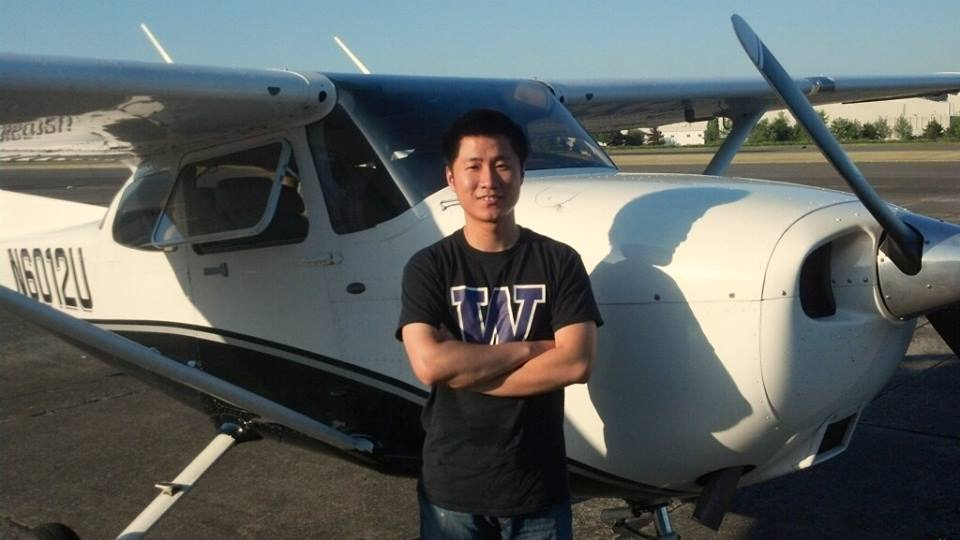

Title: First solo!
Date: 2014-06-01 19:00:00
Category: Alive
Tags: Chinese, Aviation
Slug: first-solo

终于到了[训练的25%](/faqs-to-learning-to-fly.html)处。。放单飞啦! 视频戳这里，自备梯子：[youtube](https://www.youtube.com/watch?v=ciD0mPNDieU)。

单飞的过程比之前想象的顺利很多，尤其是最后一次着陆很完美。突然领悟到教练说，Landing an airplane is just like your first sex with your girlfriend. you slip in a bit, if she doesn't slap you, then try a little more, a little more. If things don't work out, slip out and make corrections… 他说完这个话就下飞机了，然后我就顿悟了着陆水平暴涨。。就是单飞的时候空中突然比较繁忙，无线电声音模糊，飞行员讲话又快，我们这个公共频率还能听到附近机场的通信，妈蛋太挑战听力了，有些没听清楚老担心突然有某位大哥出现在我面前将我击落。。左顾右盼脖子都酸了。。

还有一些训练过程中的趣事：

_May 31st_

起飞不久掉了个头，跟跑道平行大概几百米的样子，教练突然把引擎关了，说咦引擎坏了，你告诉我怎么紧急迫降。我心里暗爽，靠还好老子早就有所准备，规则都背熟了。马上调整速度，然后找迫降场地。。咦不远处有个足球场，就那里了！然后跟教练说，好，你看，我们速度稳定下来了，就降那个球场吧！教练满脸黑线。。指着右边说。。你看那是啥。。我刚想说你傻逼啊，那不是我们刚起飞的跑道啊。。嗯？跑道。。跑道。。突然想起了那个喝水的乌鸦。。乌鸦去小溪边又叼了个石子，扔到了瓶子里，瓶子里的水终于快到了杯口，眼看就可以喝到水了！于是乌鸦又去了小溪边。。嗯？小溪。。小溪。。。。

然后还做了云中飞行的模拟训练。教练搞了个罩子把我的眼睛卡住，这样视线就只能看见仪表，看不见外面，从而模拟黑夜或者云中看不见地面的情况。要诀是千万不要相信自己的身体，只能根据仪表来飞行。然后教练又把我眼睛遮住，他来瞎JB飞把飞鸡搞到一个诡异的状态，什么左倾俯冲，或者一边超级爬升一边向右转啥的，然后让我来恢复。闭着眼睛的时候只能感觉一阵超重一阵失重吓尿了好么，还以为要挂了。然后睁开以后七扭八扭还好又恢复过来了。。中间有次还被骗了，尼玛超失重若干次以后觉得卧槽这次肯定傻逼了，转的这么猛，感觉飞鸡已经肚皮向上了。。睁眼发现嗯？你他妈在玩我？这不是正常飞行状态么。。果然不能相信身体啊。。

_May 22nd_

继上次眼睛太小把eye tracking搞挂以后，这次又来了个座位调到最靠前脚还是够不到方向舵。。。教练也无奈了。。比划了一下我的身高，然后摇摇头说以后你还是带个枕头来开吧。。。垫在腰那里这样脚就能够到了。。。所以人家带的公文包装的是超帅的飞行耳机，各种高大上的飞行图表，我的会塞个枕头么。。。

_May 10th_

今天才知道有个东西叫resident airport. 大概300多家人住在一起，紧靠着机场。家家都有机库或者停机坪，可以通到滑行道上去。当着陆以后教练指着旁边一个房子说这是我的房子那个是我的机库时，感觉浑身笼罩着光辉，逼格瞬间爆表了。

今天还第一次用了自动驾驶，我靠太神了！！自动转弯爬升降低维持高度导航警示附近的其他飞机啥的。就是油门要自己调一下，可能因为开的这个飞机没有装备自动油门。科技太发达了~~

_May 3rd_

今天去机场，教练说咦你看这个天气正好是法定能起飞的最低能见度，雷达图上还有一坨雨向我们移过来，我们上去绕机场几圈看看风头吧，要是雨不大我们就练练，雨下大了我们就撤。然后起飞检查折腾了20分钟终于起飞了。。妈蛋雨下的跟屎一样大，毛都看不见好么。好不容易爬升准备开始绕个圈子，塔台开始喊，那谁谁，雨太他妈大了我们根本看不见你，而且跑道要关闭了，你们收了神通（大雾），阿不，快点降落吧擦。我腿都软了，全靠教练看着仪表飞回来。。着陆的时候两眼一抓瞎，我在那死拉杆。教练叫：拉你妹，我在往前推呢救你一命 ，不要拱我！=。= 然后。。所以我们绕了机场一圈，飞了5分钟回来了。。还真是省钱啊。。与此同时，还有个漆有波音标记的小飞机载着四个人起飞向风暴中心去了。。着陆以后我们和其他同学进行了深入的交流，对这个小飞机一不怕痛二不怕死的精神表示了由衷的钦佩。（今天吓尿了，而且第一次和塔台通话无比紧张还被嘲讽了。。写状态的时候手还在抖。。） 