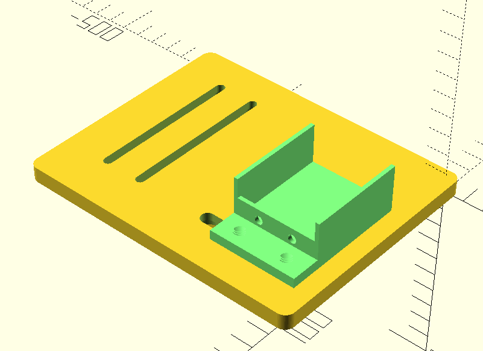

Title: Auto focus solution for SharpStar FMA180 
Date: 2021-05-29 18:05
Category: Computing
Tags: English, Astrophotography, DIY
Slug: auto-focus-solution-for-sharpstar-fma180

Bought a SharpStar FMA180 recently for wide field use.
Probably because of the small aperture (40mm f/4.5, 180mm focal length), it doesn't come with a regular focuser, but has a focus ring just like regular lens.
But the ZWO EAF I use only supports telescope-style focusers.
So I use a belt to make the EAF work with the FMA180.

The idea is simple.
Just print a dovetail to hold both the scope and a EAF rack, which is then fixed to the dovetail using screws.
The focus ring of the scope (or any lens) can be connected to the EAF via a belt.
The 3d models and instructions can be downloaded on github: https://github.com/grapeot/FMA180AutoFocus/ .
The rendered models look like this:

Several points worth noting:

1. The belt is regular GT2 belt, which can often be found on [3D printers](/3d-print-faq.html). The The pulley has a bore of 5mm. I use a 280mm length belt, so it fits the FMA180 and the dovetail. When using a belt with a different length or a different scope, you need to adjust the parameters of the dovetail model.
2. Because the focus ring is a bit taller than the scope body, the belt cannot be installed if we directly screw the scope to the dovetail. In this case, four washers are needed between the dovetail and the scope. They are also printable -- check washer.stl. The other two STL files are for the dovetail and the EAF rack. I used OpenSCAD to develop, so I also put the .scad files in the repo.
3. Assembly is easy -- just using screws. To fix the scope to the dovetail, M4 screws with the scope are used. Don't forget to put the washers beforehand. To fix the EAF to the rack, the M4 screws coming with the EAF can be used. Interestingly these two M4 screws have different pitches. To fix the EAF rack to the dovetail, M6 screws are used. Note they need to be bought separately. The suggested assembly order is, first install the EAF rack but leave the screws loose. Then install the FMA scope. Leave the screws loose as well. Then install the belt. Adjust the positions of the FMA and the EAF, such that the EAF pulley and FMA focus ring are aligned, and the belt has enough tension. Then tighten the screws. Pay attention to the screws connecting the EAF rack and the dovetail. Don't over-tighten them. The threads are 3D printed on plastic anyway.
4. One caveat of FMA180 is the focus ring actually moves when focusing. My design doesn't accommodate this. So in order for the [auto focus](/auto-focus.html) to work properly, before installing the FMA180, you need to roughly focus the scope. I find 10mm on the focus ring gives me good results. In this case, given the auto focus process has pretty limited movement, it can be performed reliably.

The final result looks like this:

And here is a result of 3 hours' Ha channel, from a 2x4 mosaic:

