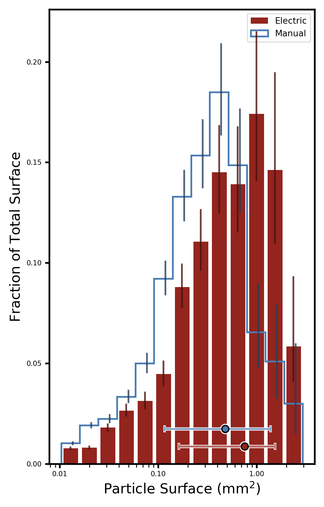
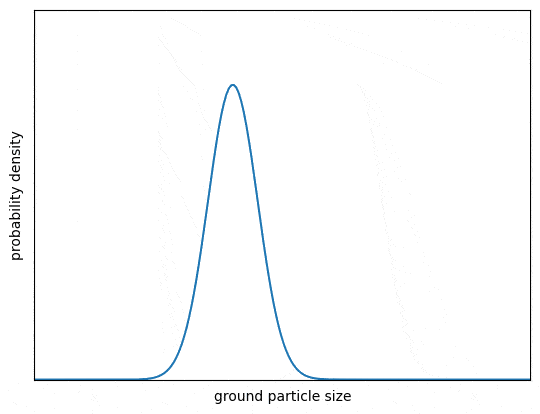
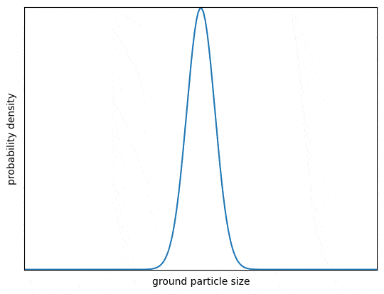

Title: 咖啡器材从观望到破产（一）———— 磨豆机的技术指标
Category: Life
Date: 2023-06-14 09:00
Tags: Coffee, Gears
Slug: grinder-tech-specs

在过去的几个月里，有不少朋友问我如何选择各种咖啡器材，包括咖啡机、磨豆机、烘豆机等。
其实网上已经有很多相关的资料和教程。为了方便大家入门，我想分享一下我之前学到的知识、实验和个人观点。
这样一方面可以帮助大家节省时间，系统地了解这些器材；另一方面也可以激发大家的思考。
这个系列有点像天文器材的介绍，但会更加佛系，不会频繁更新。

在具体的这篇文章中，我会先介绍磨豆机相关的技术指标。
这里不会推荐具体的产品，也不会分析技术实现，例如平刀和锥刀的区别等。
主要讨论的是指标本身，也就是说，对于非商业的业余爱好者来说，什么样的磨豆机是好的。

磨豆机的核心指标其实很简单，主要包括两项：一项是可控制，一项是可重现。
我们先说可控性。
这里的控制不仅仅是指磨豆的粗细————有一个常见的误区是认为磨豆机的质量主要看能磨多细，越细越好。
这种认识不能说完全错误，但也是片面的。
磨豆机的核心指标应该是磨出来的咖啡粉的颗粒大小分布，如下图所示。

在咖啡磨豆机磨出来的咖啡粉中，有些粉末颗粒较粗，有些颗粒较细。如果我们绘制一个二维分布图，横轴表示颗粒大小，纵轴表示占该大小颗粒的比例，就可以得到一个分布曲线。
这个曲线之所以重要，是因为它直接影响到咖啡的萃取效果。
咖啡萃取本身可以写很多篇文章，但如果从一个非常high level、简化的版本来看，萃取主要是将咖啡中的水溶性物质溶解到水中的过程。
这个过程通常可以分为三个阶段：首先是酸味物质的释放，接着是甜味和其他令人愉悦的风味物质的释放，最后是苦味物质的释放。
因此，如果萃取仅仅经过第一阶段，咖啡会偏酸，也叫欠萃。如果萃取到最后一个阶段，咖啡会偏苦，也叫过萃。
只有在适当的时候结束萃取，才能得到风味丰富且口感均衡的咖啡。

那这跟磨豆机的曲线有什么关系呢？主要联系在于每一粒咖啡粉都会经历这三个萃取阶段，而且越细的粉，因为它的相对表面积越大，所以萃取过程就越快。
我们可以看到，这个曲线对于咖啡萃取的影响主要分成两个方面。
第一个方面是曲线偏左还是偏右。
大致来说，曲线越偏左，咖啡粉的平均大小就越小，也就更容易过萃，导致偏苦。
如果偏右，就意味着咖啡粉的平均尺寸更大，这会减缓萃取速度，容易导致欠萃，让咖啡过酸或者味道寡淡。
但是要注意，我们在评价磨豆机的好坏时，并不是仅仅看它偏左还是偏右，比如偏左就是好磨豆机，偏右就不是。
这里要强调一个控制的概念，也就是磨豆机应该提供一种机制来控制磨出的咖啡粉粒度分布是偏左还是偏右。
如下图所示，一般来说，不同的咖啡需要用不同的粒度分布。对于意式咖啡来说，它更需要偏左的粒度分布，也就是咖啡粉的尺寸应该更小。
而对于手冲咖啡来说，它需要偏右的粒度分布。这主要是由于二者的萃取原理和时间不同所决定的。

咖啡粉大小分布曲线的左右控制

一个好的磨豆机应该能够自如地控制粒度分布的左右，也就是说，你让它偏左它就偏左，你让它偏右它就偏右，而不是只能在一个非常狭窄的范围内调整。
当然，有的磨豆机采用多刀盘设计，也就是在冲意式和手冲咖啡的时候会采用不同的刀盘。
通过换刀盘，虽然每个刀盘能控制的范围相对局限，但它可以实现对不同场景的兼容。
还有的磨豆机完全是为手冲咖啡设计的，它就不能磨意式咖啡粉。
这种情况我们一般不认为是个缺陷。

这个曲线的另一个重要参数是它的平缓程度或集中程度。
平缓指的是整个曲线分布得很开，有的粉在分布的左边，有的粉在分布的右边。
集中则指的是曲线像一个尖峰，大家的尺寸都差不多，如下图所示。
不论是平缓的曲线还是集中的曲线，它们都有自己适应的场景。
比如说，当曲线平缓时，可以看到有的粉在曲线的左边，更容易过萃；有的粉在曲线的右边，更容易欠萃。
在一定程度内，这可以给咖啡的口味带来更丰富的变化，让整个风味更加多样。
但是不能过分，如果曲线铺得太开了，会让咖啡变得又苦又酸，因为同时有大量的粉欠萃和过萃。
对于意式咖啡来说，因为它的萃取非常猛烈且快速，所以往往需要一个很集中的曲线。
但是对手冲而言，因为它有其他变量，尤其是分阶段的冲煮和时间的控制，可以精细地调节每个阶段的萃取率和萃取方式，因而可以使用更加平缓的曲线。

咖啡粉大小分布曲线的平缓程度的控制

和曲线的位置类似，这里并不是说好的磨豆机就一定会给出一个更平缓的曲线或者更集中的曲线，而是说它可以给用户提供一些控制。
当我们需要曲线集中的时候，它就能做到；当我们需要平缓曲线的时候，它也能做到。
一般来说，这两个参数是通过两个因素来控制的。磨豆机会通过磨盘的间隙来控制曲线的左右移动，通过转速来控制曲线的集中程度。

那我怎么知道一个磨豆机的曲线控制好不好呢？
这有一些现成的软件可以测量。
我们可以把磨豆机磨出来的粉均匀地铺在一张滤纸或者玻璃板上，然后用相机对它进行拍照。
有专门的程序可以针对这个照片进行咖啡粉的自动定位和分析，从而画出这样的曲线，比如[Coffee Grind Size](https://github.com/jgagneastro/coffeegrindsize)。

可控制已经在上面讲了很多。可重现的意思是说，如果我今天把刻度打在这里，用这个磨盘间隙和这个转速得到了这样的粉的分布，
那么只要我不换豆子，第二天我就可以期待得到一样的粉的分布曲线。
后天我把刻度改了一下，大后天又改回来，我仍然可以期待得到一样的分布曲线。
因此，可重现的意思就是说，这个磨豆机可以提供一种方法来让我们有一种peace of mind。
只要我把参数和豆子打到这个位置，我就会得到和以前一样的结果。

对于商业磨豆机来说，它具有一些额外的性能指标，尤其是连续工作和高速磨豆的能力，因为这直接关系到盈利。
如果磨豆机的速度成为出品效率的瓶颈，那将是非常不好的。
因此，商业磨豆机需要具备高速磨豆、连续工作以及可控制和可重现的功能，这些技术难度比非商业磨豆机要求更高。
这也是商业机器价格较高的原因。
然而，对于非商业制作咖啡来说，很多时候出品的过程本身就是一种放松和享受，因此并不需要高速磨豆功能。
所以，我们没有必要特别追求商业磨豆机。