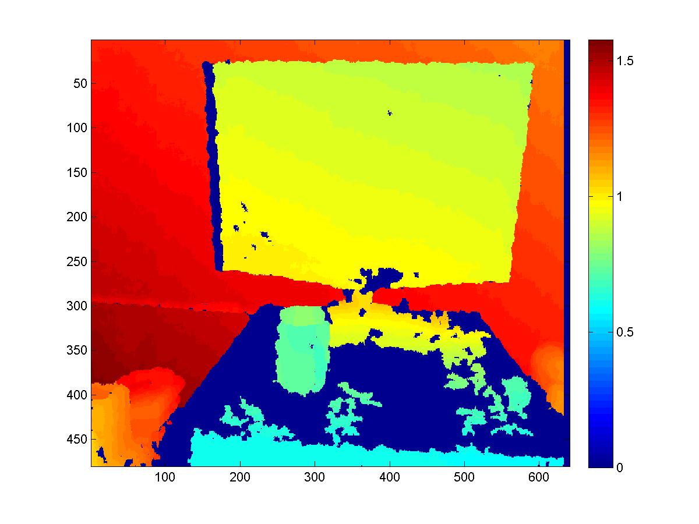
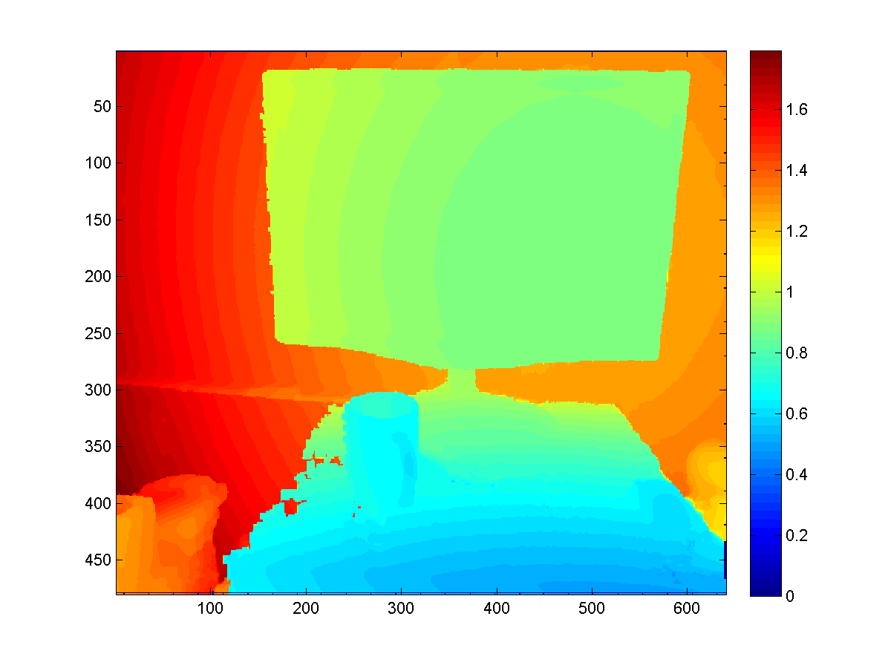
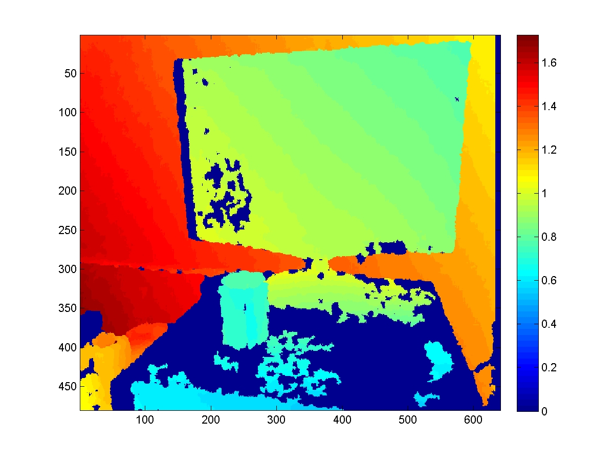
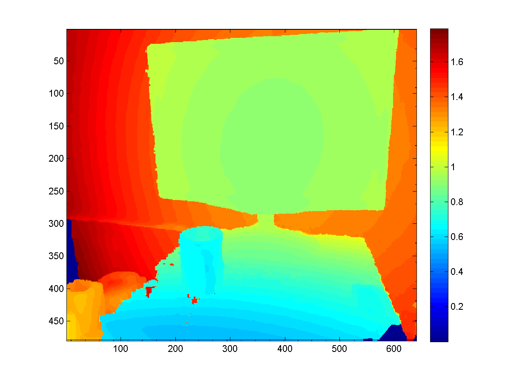
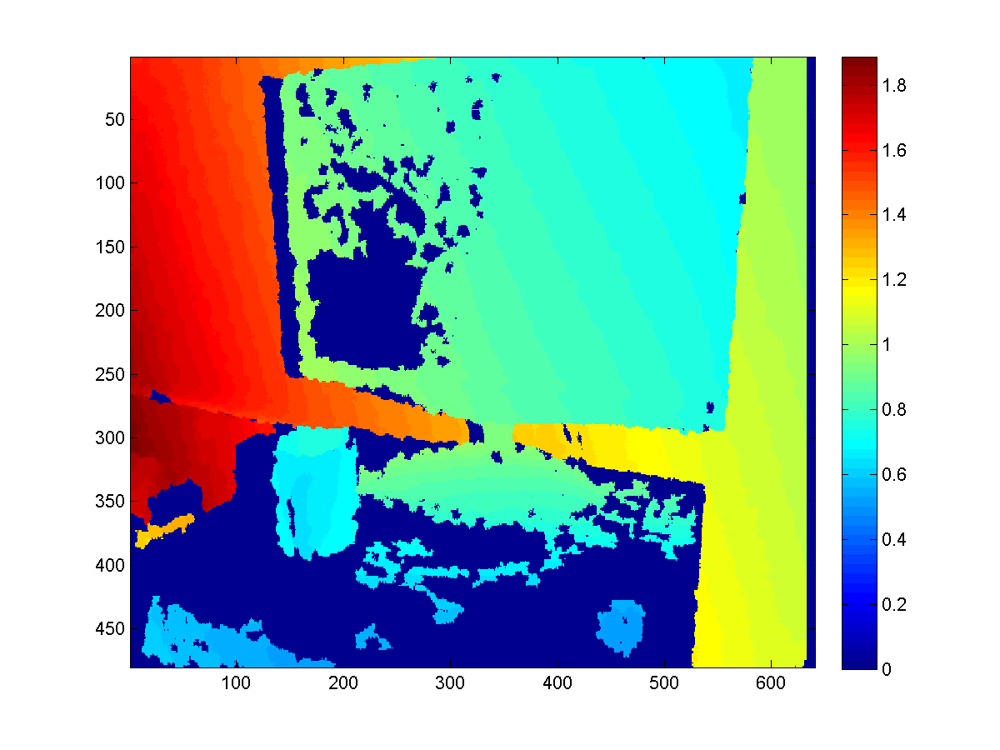
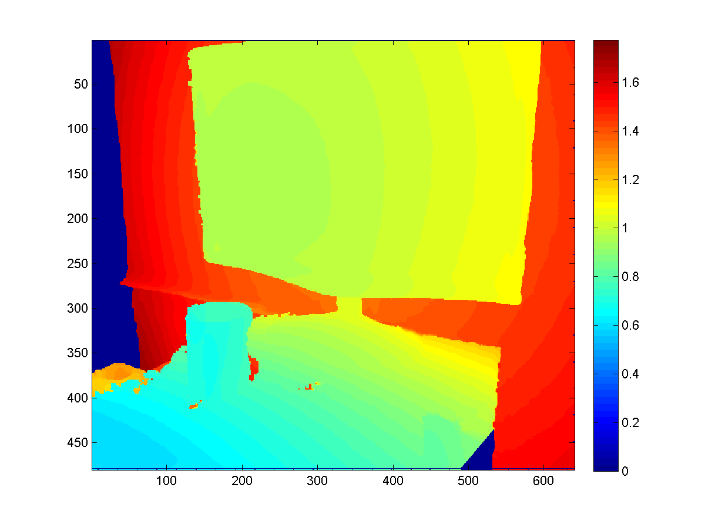

Title: Some Technical Details about KinectFusion
Category: Computing
Date: 2013-09-17 16:00
Tags: Kinect, Math, PhD
Latex:

KinectFusion is a powerful 3D reconstruction technique based on Microsoft Kinect Sensor.
It's included in the Microsoft Kinect SDK, which is pretty easy to use. 
But if you wish to do some serious vision applications based on that, more technical details need to be figured out.
And here are some notes I took these days.

## WorldToCamera matrix

Just as the name indicates, it's just the external parameter matrix of the camera (i.e. Kinect here), consisting of the rotation and the translation info.
You can get it from the `GetCurrentWorldToCameraTransform()` function in the SDK.
More specifically, the matrix looks like

$$\begin{bmatrix} R & t \\\\ 0 & 1 \end{bmatrix}.$$

And to transform a 3D point in the global coordinates to the local 3D coordinates of the camera, one only needs to do

$$\begin{bmatrix} x_l \\\\ y_l \\\\ z_l \\\\ 1 \end{bmatrix} = \begin{bmatrix} R & t \\\\ 0 & 1 \\\\ \end{bmatrix} * \begin{bmatrix} x_g \\\\ y_g \\\\ z_g \\\\ 1 \end{bmatrix} $$.

From the code it's also easy to know the (inverse of the) internal matrix of the Kinect (optical) camera (when the resolution is $640 \times 480$).

$$A = \begin{bmatrix} 594.21 & & 320/594.21 \\\\ & 591.04 & 240/591.04 \\\\ & & 1 \end{bmatrix}$$,

then the (homogeneous) coordinates of the point can be computed as

$$ \begin{bmatrix} u \\\\ v \\\\ 1 \end{bmatrix} = A \begin{bmatrix} x_l/z_l \\\\ y_l/z_l \\\\ 1 \end{bmatrix} $$

To verify the correctness of your implementation, simple export two RGBD photos with `WorldToCamera` matrices, manually label the same 3D point on the two depth photos, and see whether they get transformed to the same 3D coordinate. 

## RGB-depth alignment

In the previous verification experiment, the reason why we don't use optical photos to label is, direct export from Kinect SDK ends up with unaligned optical and depth photos.
That is, since the optical camera and the depth camera are not in the position (and have different view of angles), their photos are not aligned, or the depth in (u, v) in the depth photo is not the "depth" for the pixel at (u, v) in the optical photo.
To build applications involving both photos, you need to first align them, or in other words, warp the optical photo to fit the depth photo (or vice versa).

It can be done with the SDK itself, with the function `CoordinateMapper.MapDepthFrameToColorFrame()`.
Since there are detailed documents in MSDN, I'd save time here by leaving yourself read the documents.
But the MATLAB code is provided [here](https://gist.github.com/grapeot/6599423).

Some assumption to use the code is, the file `imgfn` stores the binary data directly exported from `ColorImageFrame.CopyPixelDataTo()`, `dfn` stores the binary data exported from `FusionFloatImageFrame.CopyPixelDataTo()`, and `idxfn` stores the binary data exported from the `ColorImagePoints` resulted from `CoordinateMapper.MapDepthFrameToColorFrame()`.

Example exporting code would look like this:

    :::csharp
    var colorImagePoints = new ColorImagePoint[depthPixels.Length];
    mapper.MapDepthFrameToColorFrame(DepthImageResolution, depthPixels, ColorImageFormat.RgbResolution640x480Fps30, colorImagePoints);
    File.WriteAllBytes(string.Format("{0}_coloridx.dat", fn),
        colorImagePoints.SelectMany(x =>
        {
            var result = new List<byte>();
            result.AddRange(BitConverter.GetBytes(x.X));
            result.AddRange(BitConverter.GetBytes(x.Y));
            return result.ToArray();
        }).ToArray());

With such alignment or rectification, we can repeat the experiment introduced in the last section with the optical photos now.

## WorldToVolume matrix

The `WorldToVolume` matrix is pretty like `WorldToCamera` matrix, mapping the world coordinates to volume coordinates.
The comment in the SDK basically illustrate how the volume coordinate works, and it's as easy to use as the `WorldToVolume` matrix,

$$\begin{bmatrix} x_v \\\\ y_v \\\\ z_v \\\\ 1 \end{bmatrix} = \begin{bmatrix} R & t \\\\ 0 & 1 \\\\ \end{bmatrix} * \begin{bmatrix} x_g \\\\ y_g \\\\ z_g \\\\ 1 \end{bmatrix} $$.

Note the $t$ in the matrix may be negative, because it's not necessary to store info too close to the camera.
And since the comment in the code mentions that the origin of the world coordinate system lies in the center of the front plane (i.e. z == 0 plane) in the volume, you may want to assign at least $2t$ space for the volume.

## Raycasting for better depth

A smart way to use the KinectFusion is to extract depth map with better quality from the volume, rather than directly fetch it from the sensor.
Since the Truncated Signed Distance Function smoothes the surfaces among frames it's seen before, such extracted depth map would be more robust to sensor noise and missing values (which is a common problem for Kinect sensor).

To extract such depth map, we need to first export the point cloud stored in the volume with the function `CalculatePointCloud()` (with the `WorldToCamera` matrix), and then map each 3D point to the camera imaging plane based on the external as well as internal matrices of the camera.

Here are some results to give you a sense.

