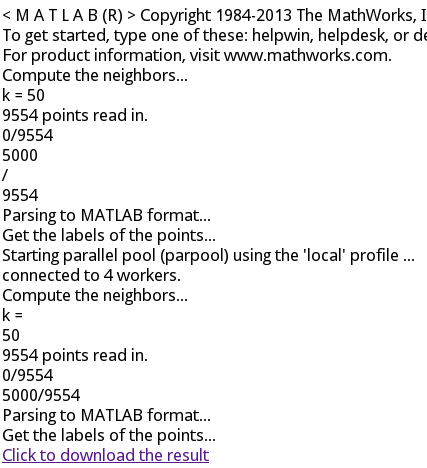

Title: Exposing an online interface for MATLAB (and potentially any language)
Category: Computing 
Date: 2014-01-13 14:30
Tags: nodejs

I was always interested in building a small cluster with my (old) computers for my research project (just like MATLAB Distributed Server or a Hadoop cluster).
While MATLAB is one of the most mature platforms for scientific computing, it's also extremely expensive, so expensive that an Ivy League college determines to exclude MATLAB Distributed Server in its academic license.
Therefore we have to build some simple (and possibly dirty) alternative for the MATLAB cluster.
And the first step is to expose MATLAB to the external world with some network interface.

Although MATLAB is able to invoke Java's `socket` library to provide some sort of interop-ability, designing a communication protocol and building everything from scratch is just a waste of time.
With the intuition to make the interface both machine and human friendly, we determine to build it as an HTTP site with a simple user interface.
Another benefit brought by such web interface is, when we have several people collaborating on the research project and other people want to give your function a quick try, they can just upload their data, wait for the computation to finish, and download the result as a `mat` file.
This is much more convenient than `git pull` plus tedious environment configuration, or long email conversations for large files back and forth.

With `nodejs` and `expressjs`, such web interface is actually very intuitive to implement.
We use `matlab -r 'load input.mat; <command>; exit;'` to do the job, `child_process.spawn`[[doc]](http://nodejs.org/api/child_process.html#child_process_child_process_spawn_command_args_options) for `nodejs` to invoke bash commands, and `res.sendfile()` to send the result back.
For the file uploading part, `expressjs` gives us an easy-to-use ([but not perfectly safe](http://andrewkelley.me/post/do-not-use-bodyparser-with-express-js.html)) approach, making uploaded file handling trivially easy.

One challenge is, generally one web response can only have one `content-type`, which means we cannot deliver the result `.mat` file and the real-time status update (i.e. the stdout from MATLAB) at the same time.
To solve this problem, we only return the status update as `text/html` for the web request, and give the user a hyperlink for the final result. 
It may require an extra mouse click, but is much eaiser to implement than multi-part HTML responses (if that's even possible).

The code is easy to understand, as pasted below:

```coffeescript
express = require('express')
_ = require('underscore')
http = require('http')
mime = require('mime')
spawn = require('child_process').spawn

app = express()
app.set('view engine', 'jade')
app.use(express.bodyParser({ keepExtensions: true, uploadDir: '.' }))
app.get('/', (req, res) -> res.render(__dirname + '/index.jade'))
app.get('/result', (req, res) -> 
    res.setHeader('Content-disposition', 'attachment; filename=features.mat');
    mimetype = mime.lookup('features.mat')
    res.setHeader('Content-type', mimetype)
    res.sendfile('features.mat')
)
app.post('/feature', (req, res) ->
    p = __dirname + '/' + req.files.file.path
    res.set('content-type', 'text/html')
    m = spawn('matlab', ['-r', "cd /path/to/your/dir; webFeature('" + p + "'); exit;"])
    m.stderr.on('data', (d) -> 
        console.log(d.toString('utf-8'))
        res.write('<div style="color: red">' + d + '</div>', 'utf-8')
    )
    m.stdout.on('data', (d) -> 
        console.log(d.toString('utf-8'))
        res.write('<div>' + d + '</div>', 'utf-8')
    )
    m.on('close', () -> 
        res.write('<a href="result">Click to download the result</a>')
        res.end()
    )
)

server = http.createServer(app)
server.listen(4100)
```

An example screenshot is also shown below, with the black texts updated along with the MATLAB computation, and the link pointing to the final `.mat` file.


