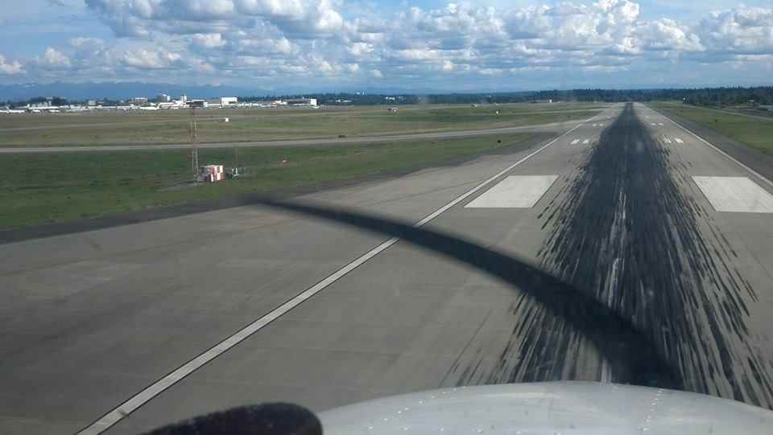

Title: May 17th
Date: 2014-05-17 20:39
Category: Alive
Tags: Chinese
Slug: may-17th

今天还真是个值得纪念的日子。

早上出发把妹子从[西雅图机场](https://yage.ai/downtownzhong-you-he-kai-fei-ji.html)接回来，终于又见到妹子了。然后正在小肥羊吃饭的时候，接到Yinxiao的电话，得知我们IROS的论文中了。终于看到了毕业的希望了好吗。真的要感谢Yinxiao让我有了进入机器人学的机会，发现原来之前以为没多少用的机器视觉算法竟然还是有很多用途的。而且那么厚道给了equal contribution这样就可以放到毕业论文里了。

然后驱车去兰顿市立机场。带妹子见了教练，然后准备起飞参观西雅图。由于风向的原因，我们从兰顿机场向南起飞，向西横跨西雅图塔科马国际机场的B级空域，计划稍后折向北边进入波音机场的空域到达西雅图市区。我们监听了一段时间塔台通信以后发现塔台并不怎么忙。于是教练提了个疯狂的要求：能不能让我们在西雅图国际机场着地后即起飞（touch and go）。我去，我连[十小时飞行](https://yage.ai/faqs-to-learning-to-fly.html)时间都没有，开着一个最高时速130节的塞斯纳小型教练机，在着陆速度都220节的喷气机中间降落，这样真的大丈夫吗教练。我读书少，不要骗我。更令我诧异的是，塔台竟然同意了。。看来真的不怎么忙啊。。我们被指挥在最短的16R跑道着陆。一些都和平时的训练一样，降油门，落襟翼，三边进场。唯一的不同是塔台频道里瞬间一片繁忙，一大坨飞机被告知有个小教练机在xx高度正在进场，请积极发现目标并目视保持距离。我们也不断收到指令说xx方向有一个xx飞机，注意保持距离。。感觉我们真是个搅屎棍啊。。好在在教练的协调下，一切都很完美。我们平稳落地，滑行少许后立刻加满油门起飞。我都激动死了，B级空域啊，国际机场啊，我在这里着陆起飞了呀。哇。

下面的事情就和平时的训练一样了，带着妹子去了西雅图上空转了一圈。作为司机，你懂得，完全没有机会欣赏景色，只有不断注意高度，和塔台通信，避让其他飞机。最终我们在兰顿着陆，kiss landing有木有。妈妈再也不用担心妹子一遇到气流就尖叫了。

然后晚上去了无敌西雅图全景的The Salty's吃饭，景色和螃蟹腿儿都超级棒。

挺多好消息的一天。终于看到了一些毕业的曙光，但愿下面的论文也能比较顺利。

(Photo credit: Jim Simon)