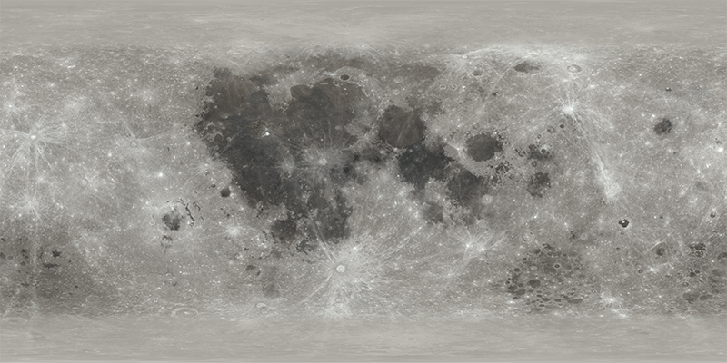
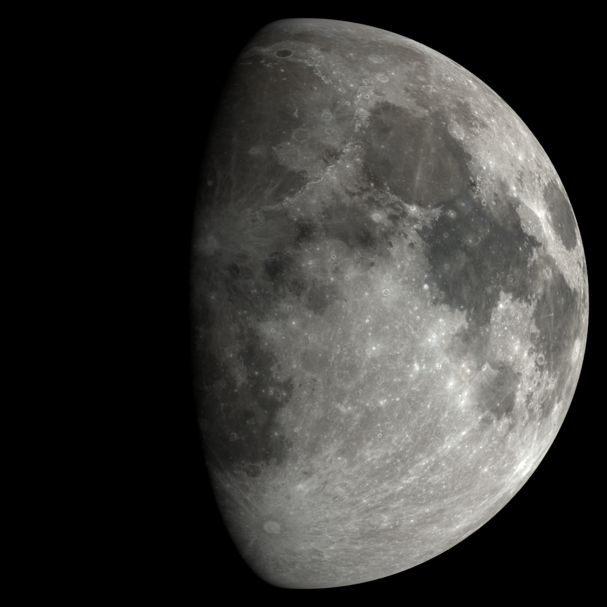
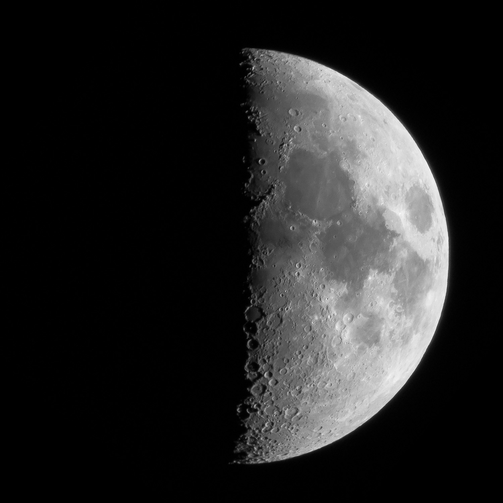
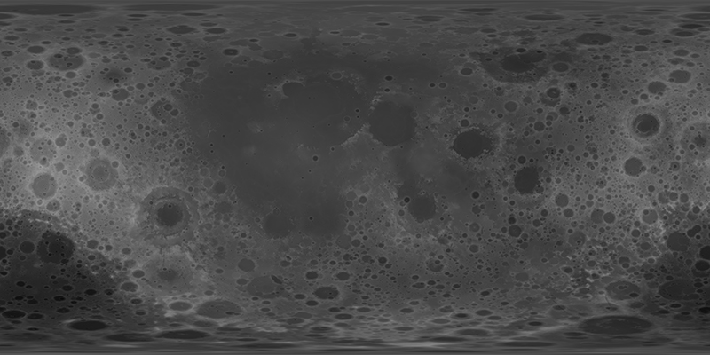
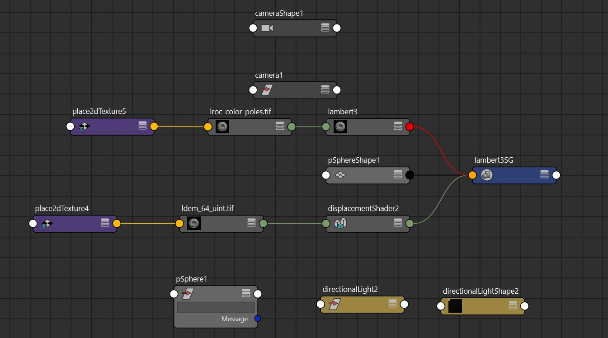
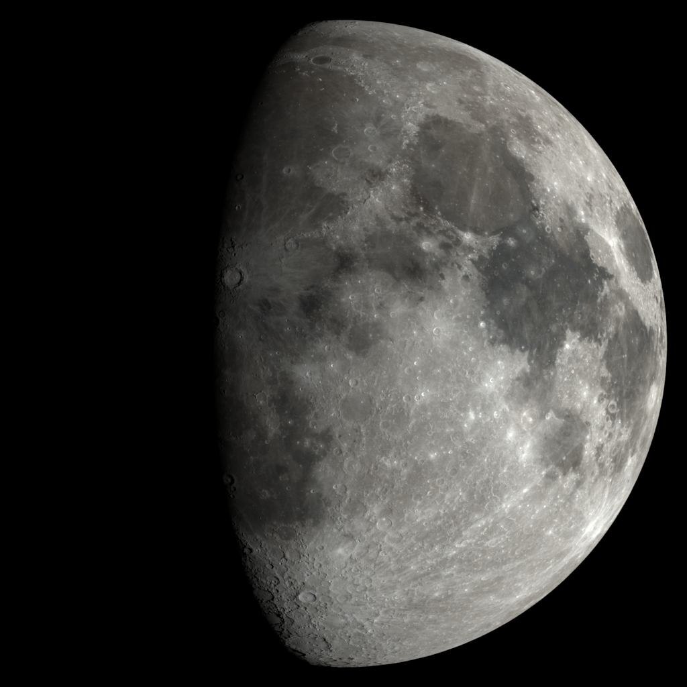
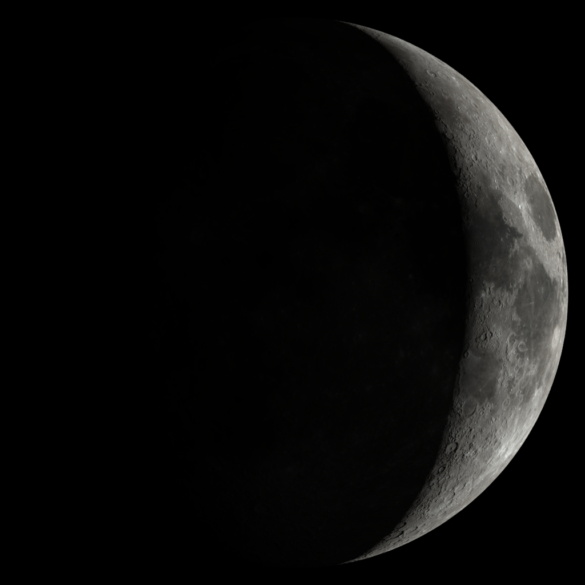
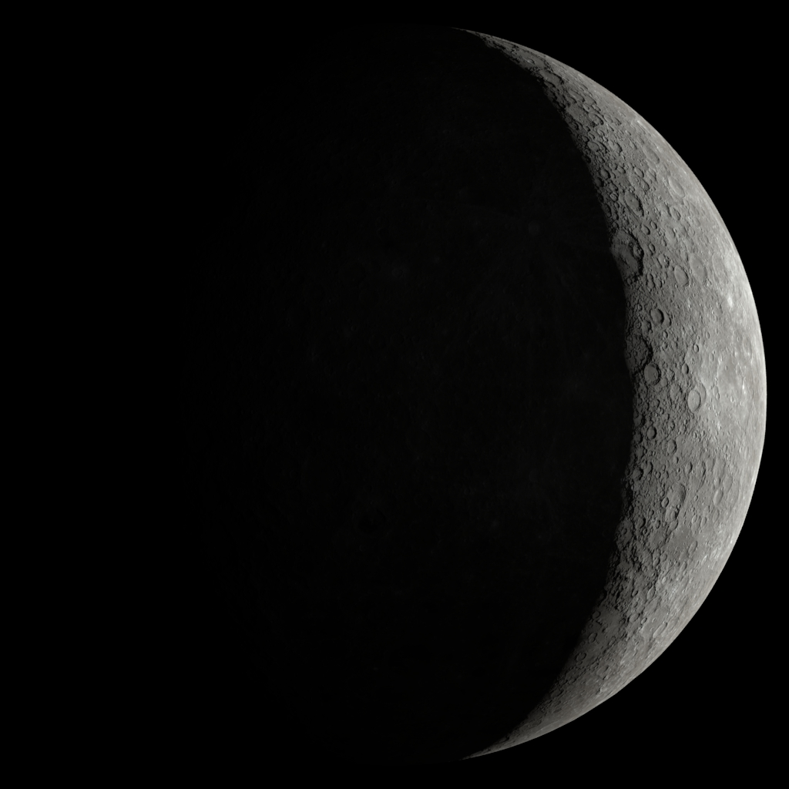

Title: 超高精度月球三维模型的制作和渲染（附墙纸下载）
Date: 2020-07-11 15:31
Category: Life
Slug: nasa-moon-3d-model
Tags: 3D, Rendering, Moon

一切的起因是在我们的量子键摄法师群里面有dalao提到，希望有一个连续变化的月相的动态壁纸。最好能显出月面的彩色，同时分辨率高一些。我自己虽然也拍月亮，但没有积累足够的数据来显示月相的变化。所以就想着，有没有可能用一个模型来渲染出来一个月面图像呢？经过一些努力，真的成功了。渲染出10k的视频没有问题。4k的效果见这个视频：https://www.bilibili.com/video/BV1wC4y1h7u5/。

整个过程挺有意思的，能够学到一些3D的基础知识，记录一下过程。也许对后来的人有帮助。

首先整个框架非常简单，月球的3D模型基本上就是一个球。我们往上贴个图就好了。NASA公布了很多月面的高精度地图，比如[这个链接](http://wms.lroc.asu.edu/lroc/view_rdr/WAC_HAPKE_NORMALIZED)，甚至有每个像素400米的高精度图像。其中含有7个波段的黑白图像，和合成出来的RGB图像。

但有个问题是这样的图像一般是矩形的，但和地球一样，月面是个球面。所以我们需要通过UV Mapping把这样的图像贴图贴到球面上去。方便的是3D渲染软件一般都有这样的功能（我用的是Maya），所以我们可以弄个球，把图往上一贴拉倒：

这里用的是平行光源，漫反射打到100%，Arnold渲染器。诶，看起来像那么回事了，而且分辨率也很高。但如果我们真的弄一张自己拍的月球来看，会发现差别还是不小的（这张图是很久以前拍的单张，分辨率不高）：

少了什么呢？月面的起伏和阴影。其实回想一下，大多数网上的视频和墙纸里出现的月面，也大都是我们前面渲染的效果。那哪里有月球起伏的图像呢？这要先从刚才的月面贴图说起了。这个月面贴图不是用地面望远镜拍摄的，而是NASA的LRO绕月飞行器在几年的时间里不断积累合成的。这个飞行器不仅有多波段相机，同时还有激光高程仪，可以精确测量月面的起伏。这个数据也是[公开的](http://wms.lroc.asu.edu/lroc/view_rdr/WAC_GLD100)，大概长这样：

其中亮度代表海拔。如果我们用一个1737.4km为半径的基准球来代表月面的话，这个图像显示的就是和月面的相对高度偏差。在3D渲染软件里也有类似的功能可以直接加载这样的地图。Maya里面需要用displacement map而不能用bump map，因为后者不能真的造成阴影。我们把这个displacement map也放进去以后，还需要稍微调整一下displacement map shader的scale，让它和月面的直径相匹配。还有一个小坑是Maya会自动模糊贴图和displacement map，所以需要把filter这个参数打成0。完成之后maya的节点结构大概是这样的：

这时候渲染出来的图像就非常逼真了！

有了这样的渲染模型，下面什么样的图都可以轻松渲染出来了。比如新月（[6k下载地址](https://grapeot.me/images/nasa_moon_waxing_crescent_full.jpg)）：

甚至月球背面都可以做到（[6k下载地址](https://grapeot.me/images/nasa_moon_back_full.jpg)）：

拿来当手机墙纸也不错。dalao们新买的XDR显示器也有适合分辨率的高清墙纸了。

这个工作还很初步，下面要改进的地方还是不少的。一个是我现在选用的是相对低分辨率的贴图和高度图，在渲染20k的墙纸的时候还是有些不理想。但是高分辨率的数据就没有直接下载的版本了，需要自己从源数据合成。所以下面需要自己合一下。一个是从视频的角度来看月球的很多特性还没有加进去，比如天平动等等。所以如果你看过真的拍出来的这种视频的话，就会觉得哪里不对。不过这个相对容易实现，我们就留作读者作业啦！