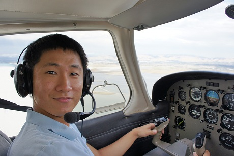

Title: Downtown重游和开飞机
Category: Alive
Date: 2012-08-05 09:29
Tags: Aviation, Chinese
Slug: revisiting-downtown-and-flying-plane

自行车借出去了，被迫走到Palo Alto downtown吃饭。一路重历了刚来Stanford时去Palo Alto Bicycle的路，Stanford Shopping Center，高大的棕榈树，Caltrain station前错综复杂的道路，一切都显得那么真实而陌生。Downtown斑驳的树影下藏着一家礼品店，还有一家非常好吃的pho。当我们骑车或者开车呼啸而过的时候，更多在意的是别的车而不是路边的风景。了解一个城市还是要在里面行走，和人们谈话啊。

下午去和Yutong一起[开飞机](/faqs-to-learning-to-fly.html)。就是教练机，两套控制装置，起飞和降落的最后阶段是教练操作，其他时候基本都是教练手完全放开自己折腾。发现还挺有开飞机天赋的嘿，转弯很平稳，副翼和垂直尾翼配合比较好，高度控制也比较流畅。问了下发现私人飞行执照只要$10k~15k，全职学1~2个月，兼职学8~10个月。很靠谱的样子。想想直接开去悠仙美地或者长岛看paper。。。嗷！大概的说就是先学地勤，然后在教练指导下在本机场50mile里转悠，然后再cross-country，从一个local机场到另一个，最后solo cross-country。最后体检，笔试，口试，实际操作考试。之后就能拿到执照啦！
 

 明天我们CMU在硅谷的intern要一起BBQ，欢送一些纽约来的傻逼吊丝们回去继续搬砖。晚上腌了一些鸡翅鸡胗鸡心。再次感慨Yutong真是贤妻良母型，其哥纸幸福乐无边啊乐无边~

 还有一周整滚蛋。[心态放宽](/inspiration-fragments-20131130.html)了不少，一切都是缘分吧，逐渐自信起来了。