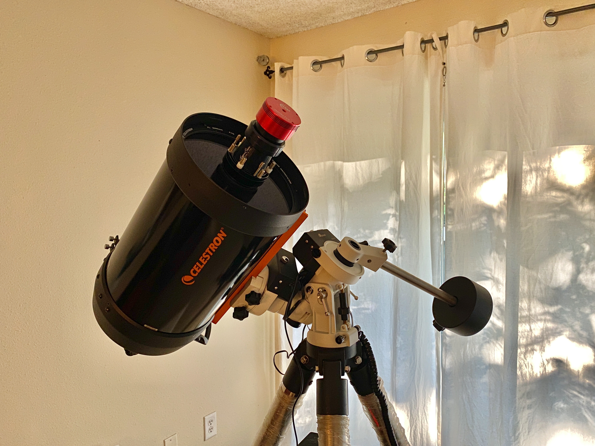
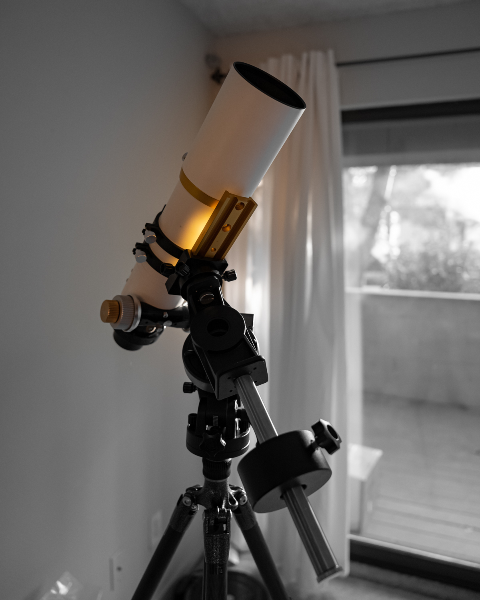
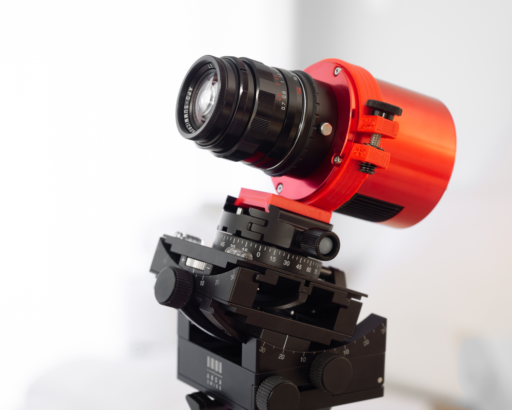
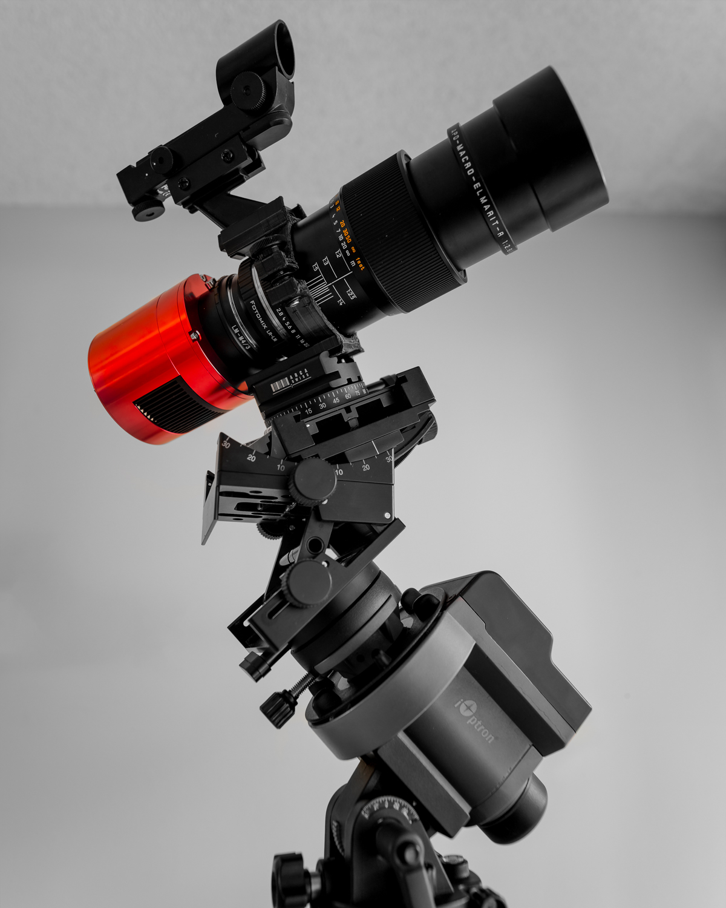
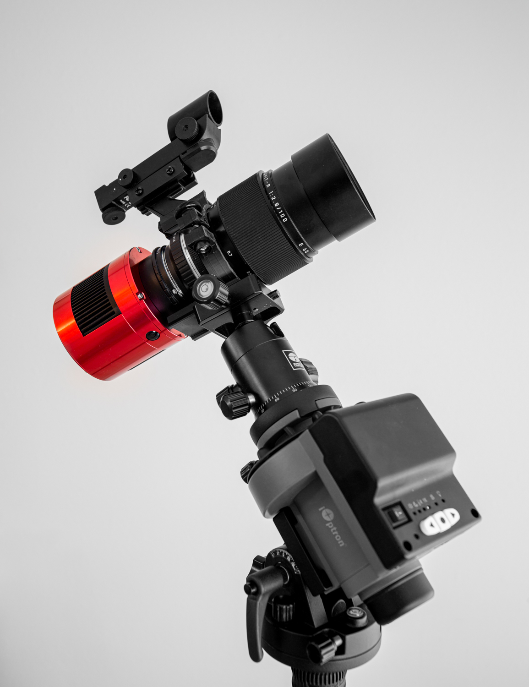
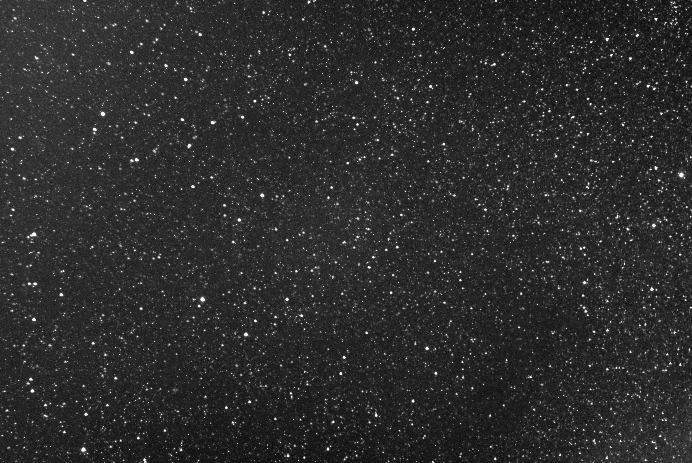
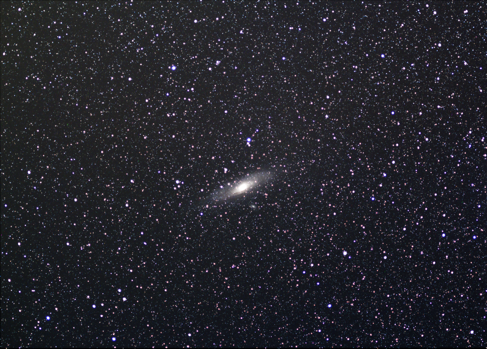

Title: 一个书包可以装下的深空配置
Date: 2020-08-07 20:55
Category: Life
Tags: Chinese, Astrophotography
Slug: portable-dso-photography-gears

虽然西雅图不是一个拍天文的好地方（天天下雨），但是作为老法师，关键在玩器材，所以我也整了一套深空的器材（HyperStar）：

这个系统非常牛逼，是390mm f/1.9的光圈，拍起来很爽，基本上30s过曝，完全不用考虑场旋、导星啥的。人家还在调光轴呢，你已经拍完收工了。。。但问题是主镜10磅，赤道仪10磅，配重10磅，三脚架10磅。光把这些东西拎个50米都喘，更别说带着到处跑了。什么出门爬山，露营，坐飞机，都是不可能的。我以前是开去乡下在农家乐里面住一晚拍摄，但现在疫情也不现实了。所以想着有没有可能弄一个1) 可以在城市里面拍深空的装备，或者2) 可以便携一点的装备，比如以后坐飞机和登山露营都可以用的。

显然第一步就是要把赤道仪换成星野赤道仪。令我很意外的是，现在的星野赤道仪已经非常好了。我用的信达大星野，在加配重的情况下，网上有人可以顶着61mm口径的的望远镜3分钟盲跟星点还很圆。想要导星的话还可以单轴导星。但我用了一段时间，经常电机卡死停止跟踪。经过调试以后发现这是因为它的平衡还是很讲究的。一般我们用赤道仪，平衡就在重锤水平（平行于地面）的位置做好就完了。但这个赤道仪不论有没有配重，都必须要先对准被摄物体，然后在拍摄位置附近把平衡做好才可以。可能因为它只有赤经的单电机，当赤纬改变的时候，平衡就要重做，否则就会电机卡死。。发现了这个技巧以后，这个赤道仪就很好用了。

然后下一步就是相机了。如果要在城市里面拍的话，窄带是一个很好的思路。但这样的话就必须要[黑白相机](/yasselblad.html)了。之前测试了一下，如果用没有改机的数码相机拍Hydrogen Alpha窄带（用的还是12nm的滤镜）的话，效率是黑白相机的1/100。因为买不起6200MM，选的是振旺的183MM Pro，1寸的底。这个机器还是很省电的，我20000mAh的充电宝测了一下在比环境温度低25度的制冷下可以撑8个小时左右。这个容量的充电宝也可以带上飞机了。

下面就是[主镜选择](/astrophoto-tutorial-4.html)了。如果真的要出远门坐飞机的话，带一个正儿八经的望远镜还是必要的。我有个200块捡漏子捡的WO-Star 71，四片APO，f/4.9，全幅成像圈，相当赞了。感觉是老公跟老婆是我这个镜子买得很便宜，才花了150块。然后老公出差，老婆把挂craigslist上200块卖了。。这件事情告诉我们，对老婆还是要坦白。

不过这个镜子对我的相机来说还是overkill了。因为等效视角相当于850mm的全幅镜头。视角拍很多天体都有些小了。所以其实我们还可以通过用普通的镜头来实现更广的视角。而且一般的摄影镜头的光圈往往也更大。考虑到1寸的底，用18mm镜头就大概相当于50mm的视角，50mm相当于135mm的视角，100mm相当于250mm。所以我弄了这三个镜头。小一点的镜头自己3D打印了一个抱箍，接在了相机上：

大一点的就得把抱箍接在镜头上了，然后需要弄一个红点寻星镜来帮助定位视野：

额，放错图了，这个是摆拍装逼的，实际运行的时候长这样（此时不用配重仍然可以正常跟踪）：

用这个设备加上Hydrogen Alpha滤镜，在光污染白区的市中心试了一下，结果还是令人振奋的。徕卡的Summilux 50mm f/1.4 ASPH镜头，光圈全开300s曝光就可以得到不错的信噪比，而且拍出来超多星星：

但慧差也是很明显了。我原来以为全幅镜头装在1寸底上面，就可以不用考虑慧差的问题了。但我还是naive了。相比之下APO Summicron 50mm f/2 ASPH全开在暗区拍摄的300s叠加长这样：

星点明显好很多。不过星星的数量倒没有明显增加，这说明Ha滤镜在市区拍摄还是很靠谱的。但最近还在下雨，希望可以尽快真的开光吧。

总之，我们就有了一个焦段灵活的便携深空装备，一个书包基本可以装下。可以在城市用大光圈+窄带不带配重快打，也可以带配重坐飞机去乡下真的架个望远镜拍。或者在城市里面积累Ha通道，去乡下拍颜色都可以。唯一要注意的地方是，坐飞机安检的时候配重要像电脑一样拿出来单独过X光，否则每次都要被单独拎出来手检。。别问我怎么知道的。。

