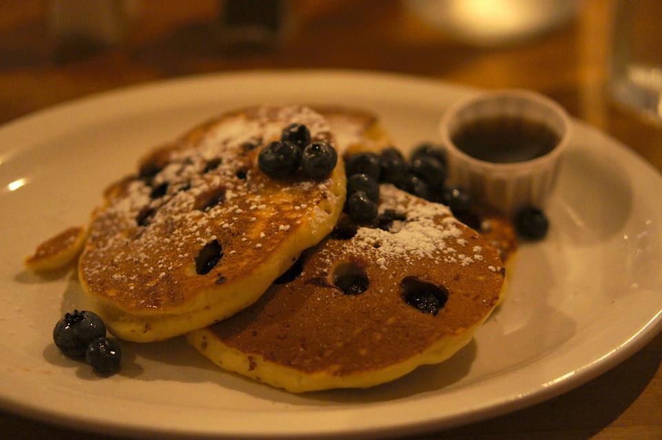

Title: 写在夏天的尾巴
Date: 2012-09-02 23:45
Category: Alive
Tags: Chinese

还记得当时刚去加州的时候和琳一起改推荐信，得知她成功拿到台湾交换的offer，一起讨论research/写代码，然后她怎么突然就回科大了。和HH一起git到1点多然后第一次从公司开车回家的场景也历历在目，然后她怎么就突然回香港了。在夏天的尾巴上，想想这个暑假好像深度参与在好朋友的生活中间，师兄们如Jun和Lei也一直提供深刻的支持。发现暑假的主线似乎就是接受正能量，传递正能量。1+1毕竟大于2，牵扯在社会中，和别人多交往，又发现了一个新的乐趣。 :)

图：在暑假的最后一天傍晚，坐在Low Library前

整个暑假感觉改变最大的是变得更加积极主动，勇于尝试，同时对人性的把握又有了新的认识。这两点其实都不是自己空想出来，而是在和朋友的互动中有所触动得到的。所以感慨真是朋友圈的档次（多聪明，深刻等等）就决定了你的档次啊。

### 勇于尝试

这个靠的是大奔和HH——一个在fb认识的女大奔性质的人物。我的内心一直都是很害羞腼腆的，所以看着大奔洒脱到处跑的生活无比向往。可是因为和大奔隔了整个美洲，他出没的校内又不怎么用，所以动力一直不足，生活中更倾向不需要与人交往的以前尝试过的安全的选择。有次在火车上就到底去餐车吃饭还是叫take-out纠结了半天，当时就想大奔或者HH在我旁边就好了，肯定一脚把踹我餐车里去。 =。=

这次在斯坦福旁边住了3个月，在HH对面坐了2个月，终于知道了这样洒脱的生活长得像什么样。其实也没有什么"受教育"的过程，只是看着他们面临决策的时候如何选择和不认识的人成为朋友，如何面对未知的情境（比如没去过的餐厅@_@）然后"化险为夷"，并且在他们的带领下体验了几次这样的生活。发现咦好像真的没什么呀（汗）。所以也开始变得开放许多，开始一个人骑车去玩，尝试不同的餐厅，认识不同的人。感觉一个暑假过后整个人完全不一样了，在纽约也更知道去探索餐厅，公园和自行车道，友好的和不认识的人交往。望着自己在理想的人生境界上越走越远，也是很欣慰的事情。现在也开始在张罗毕业旅行的事情了。（擦这个还真遥远）（不过中间也是可以跑跑短途啦）（在加州的最后一天终于把这俩人介绍认识了，哈哈，TT不要打我呀~应该没事的~HH看不上大奔的~ xD）（咦用叠字做名字的真多）

图：做一个吃货

### 人性的把握

另一个感想来自师兄Jun和好基友们fx/评委老湿。以前处事的时候很多时候都是单纯的从所谓"效率"出发，而没有太多的考虑他人的感受和个性。比如和别人合作时有时会天真地觉得，我对这些模块都很熟，干脆都做完算了，这样整体效率会更高（倒不一定是因为看不起别人或者逞能，只是单纯的觉得这部分更熟）。可是这样往往会适得其反。比如别人的自尊会被侵犯，觉得你这么能那都你干好了，傻逼！现在想想这就是不够成熟的表现，单纯的想"对别人好"，却不知对别人好也是要讲方法的。像这样自作主张抢别人活干就是不理解人性，不理解别人怎么想，更可能触怒他人。

要有效的和别人合作，要知道自己想要的是什么，别人想要的是什么。Get things done是一方面，但人还有很多心理上的需求，自我表现的欲望，对他人肯定的渴求，领导他人的成就感，或者是对深刻见解的偏好，等等等等。有些需要满足别人，有些则要注意克制自己，比如自然的满足别人的虚荣心挺好，但践踏别人的自尊心来满足自己的虚荣心是非常愚蠢的事情。还有些东西别人想要但不能轻易给他，有时候自我表现的欲望也不能完全压制，要表现强势些来impress对方，这就是更高级的战术了。高级战术当然有高级的应用领域，比如把妹。xD

于是想起最近看的一篇[关于小聪明的文章](http://blog.renren.com/blog/237581586/868991994)，很多聪明的人小时候（比如大学前）单打独斗都很强，但一旦面临复杂到一定程度，必须合作的问题时就败下阵来。一个很重要的原因就是他们在合作过程中过分强调团队的效率忽略了别人的心理需求。这样自己狂日在短期内团队的效率可能有所提高，但大家的关系受到了损害，长期上会发展的不健康。所以在合作过程中不一定是"有利于团队"的事情就要去做，有时候自己"偷偷懒"，其实更有利于团队的长期发展，而且别人对的印象反而会更好。

### 写在夏天的尾巴

其实夏天也没有确切的结束点，也未必就代表了人生一个阶段的结束或（新学期）新气象的开始。人要想活的开心，成为自己想成为的人，立志，读书，玩，与人交往。。。trick也就那么几（千?万?）个。我们都是经过应试教育洗礼的人，对于接触一个新东西，一个一个学会里面的trick，做得越来越好的感觉太熟悉了。和文化课一样，人生的成长也是无它，唯手熟尔。在夏天的尾巴，很庆幸有了一个精彩的暑假，认识了那么多臭味相投的朋友们，也明显感觉到了自己的成长。继续前行，嗯，[慢慢来比较快](/man-man-lai-bi-jiao-kuai.html)。